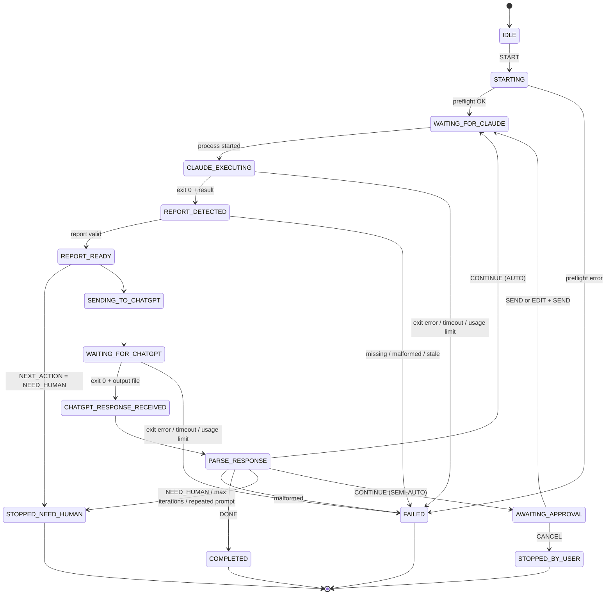

# AI Bridge — Architecture & Feasibility Report

| | |
|---|---|
| Ngày | 2026-09-25 |
| Người viết | Lead Software Architect (Claude — chạy trong Claude Desktop, tab Code) |
| Phạm vi | Khảo sát môi trường, đánh giá khả thi, đề xuất kiến trúc MVP. **Không có application code.** |
| Máy khảo sát | Windows 11 Home Single Language 25H2 (build 26200.9457), x64 |
| Trạng thái | **Chờ user trả lời Open Questions (§18) trước khi bắt đầu MVP** |

**Quy ước nhãn**

| Nhãn | Ý nghĩa |
|---|---|
| **CONFIRMED** | Đã kiểm tra trực tiếp trên máy này, hoặc trong tài liệu/điều khoản chính thức |
| **LIKELY** | Có bằng chứng gián tiếp mạnh, chưa chạy thử end-to-end |
| **UNKNOWN** | Chưa kiểm chứng được — cần PoC hoặc thông tin từ user |
| **BLOCKER** | Chặn phương án tương ứng cho tới khi được giải quyết |

Mọi kiểm tra trong khảo sát đều **read-only**: không gửi tin nhắn, không nhập text vào app, không đổi system setting, không đọc credential. Tác động duy nhất lên máy: tạm restore cửa sổ ChatGPT (không lấy focus) khoảng 24 giây rồi minimize lại như cũ.

---

## 1. Executive Summary

**Kết luận: KHẢ THI, chi phí phát sinh $0 — nhưng KHÔNG nên dùng UI automation của hai app desktop làm kênh chính.**

| Câu hỏi | Kết luận | Nhãn |
|---|---|---|
| Tự động hoá vòng Claude ↔ ChatGPT, không copy/paste, không trả thêm tiền? | Có — qua CLI chính thức của hai nhà cung cấp, **đã cài sẵn và (một bên) đã đăng nhập** trên máy | CONFIRMED (thành phần) · LIKELY (end-to-end, cần PoC) |
| Điều khiển Claude Desktop bằng UI Automation? | Làm được một phần, không ổn định, rủi ro điều khoản | LIKELY khả thi kỹ thuật · không khuyến nghị |
| Điều khiển ChatGPT App bằng UI Automation? | Hiện **không đọc được** ô nhập/tin nhắn qua UIA | **BLOCKER** |
| MCP làm kênh truyền chính? | Không — MCP không thể chủ động mở lượt hội thoại | CONFIRMED (thiết kế giao thức) |

**Ba phát hiện quyết định kiến trúc**

1. **Tab Code của Claude Desktop chỉ là giao diện; "động cơ" là Claude Code.** Mỗi phiên tab Code là một process `claude.exe` (Claude Code 2.1.281) do Claude Desktop khởi chạy, giao tiếp qua `--input-format stream-json --output-format stream-json` — CONFIRMED. Claude Code có chế độ headless chính thức (`claude -p`), nên AI Bridge điều khiển được *cùng engine đó* qua stdin/stdout mà không chạm vào UI.
2. **App "ChatGPT" trên máy là package `OpenAI.Codex`, và nó mang theo Codex CLI đã đăng nhập bằng tài khoản ChatGPT** (`codex login status` → "Logged in using ChatGPT") — CONFIRMED. `codex exec` là kênh non-interactive chính thức: mặc định sandbox read-only, ghi message cuối ra file, resume theo session id, đọc prompt từ stdin.
3. **UI Automation không phải kênh ổn định.** ChatGPT App không lộ nội dung qua UIA kể cả khi đã restore cửa sổ và probe MSAA/IAccessible2 — BLOCKER. Claude Desktop chỉ lộ cây UIA sau khi Chromium tự bật accessibility (có độ trễ; AutomationId do React sinh ngẫu nhiên). Ngoài ra, Consumer Terms của Anthropic cấm truy cập bằng bot/script (trừ API key hoặc khi được cho phép rõ ràng), còn Terms of Use của OpenAI cấm trích xuất Output một cách tự động/lập trình — CONFIRMED văn bản.

**Đề xuất: kiến trúc "Official-CLI-first"**

- `ClaudeAdapter` → **ClaudeCodeCliAdapter**: `claude -p`, `--session-id` / `--resume`, prompt nguyên văn qua stdin.
- `ChatGPTAdapter` → **CodexCliAdapter**: `codex exec` / `codex exec resume`, sandbox read-only, prompt qua stdin, response qua `-o`.
- **ManualClipboardAdapter**: phương án dự phòng có người trong vòng (an toàn tuyệt đối về điều khoản).
- Adapter GUI (UI Automation) để Phase 2, dạng thử nghiệm, chỉ bật khi user chấp nhận rủi ro.

**Việc cần user làm trước khi code**

1. Quyết định chấp nhận Official-CLI-first (§18, Q1).
2. `claude update` rồi đăng nhập Claude CLI bằng tài khoản subscription — CLI hiện báo `loggedIn: false` (CONFIRMED).
3. Trả lời các câu hỏi về gói subscription và quyền của executor (§18).

---

## 2. Confirmed Environment

### 2.1 Hệ thống

| Hạng mục | Giá trị | Nhãn |
|---|---|---|
| OS | Windows 11 Home Single Language, 25H2, build 26200.9457, x64, en-US | CONFIRMED |
| Phần cứng | RAM 15.7 GB, 8 logical CPU, 1 màn hình 1536×864 (logical, có DPI scaling) | CONFIRMED |
| Quyền | Shell không phải admin, UAC bật; Claude và ChatGPT chạy không elevated → không vướng UIPI | CONFIRMED |
| PowerShell | Windows PowerShell 5.1; **không** có PowerShell 7 (`pwsh`) | CONFIRMED |
| .NET | .NET Framework 4.8.1; UIAutomationClient + UIAutomationCore có sẵn; **không** có .NET SDK | CONFIRMED |
| Node.js | v24.11.0 · npm 11.6.1 · pnpm 10.33.2 (bun có shim qua npm) | CONFIRMED |
| Công cụ khác | Python 3.11.9, uv, git 2.47.0, GitHub CLI, winget | CONFIRMED |
| Native build | Visual Studio Build Tools 2026 (18.7) có VC++ tools | CONFIRMED |
| Biến môi trường chi phí | `ANTHROPIC_API_KEY`, `OPENAI_API_KEY` **không** được đặt | CONFIRMED |
| Cờ screen reader | `SPI_GETSCREENREADER = False` | CONFIRMED |
| `rtk` | **Không** có trên PATH, dù `~/.claude/CLAUDE.md` yêu cầu mọi lệnh phải prefix `rtk` | CONFIRMED |

### 2.2 Claude Desktop

| Hạng mục | Giá trị | Nhãn |
|---|---|---|
| Gói cài | MSIX `Claude_pzs8sxrjxfjjc` v2.9939.2.0 (`C:\Program Files\WindowsApps\...`) | CONFIRMED |
| Công nghệ | Electron: có `resources\app.asar`, mô hình process Chromium (renderer / gpu / utility) | CONFIRMED |
| Protocol / alias | `claude://` (HKCU\Software\Classes\claude); execution alias `claude-desktop.exe` | CONFIRMED |
| MCP config | `%APPDATA%\Claude\claude_desktop_config.json` **không** có `mcpServers` | CONFIRMED |
| Tab Code | Mỗi phiên = 1 process `%APPDATA%\Claude\claude-code\2.1.281\claude.exe --output-format stream-json --input-format stream-json --verbose --permission-prompt-tool stdio --resume=<uuid> --allowedTools ...` | CONFIRMED |
| Auth của tab Code | Desktop tự cấp và làm mới token cho process con (biến `CLAUDE_CODE_SDK_HAS_HOST_AUTH_REFRESH`, `CLAUDE_CODE_OAUTH_SCOPES`) | CONFIRMED (tên biến) · UNKNOWN (cơ chế) |
| Hooks trong tab Code | Hooks trong `~/.claude/settings.json` có chạy: SessionStart hook và PreToolUse "GateGuard" đã kích hoạt ngay trong phiên khảo sát này | CONFIRMED |

### 2.3 Claude Code CLI độc lập

| Hạng mục | Giá trị | Nhãn |
|---|---|---|
| Binary | `C:\Users\binhp\.local\bin\claude.exe` **v2.1.161** — cũ hơn bản trong Desktop (2.1.281) | CONFIRMED |
| Đăng nhập | `claude auth status` → `{"loggedIn": false, "authMethod": "none"}`, kể cả khi đã loại bỏ biến môi trường của Desktop | CONFIRMED → **BLOCKER nhỏ** (user đăng nhập một lần) |
| Flags headless | `-p/--print`, `--input-format`, `--output-format`, `--session-id <uuid>`, `-r/--resume`, `-c/--continue`, `--permission-mode`, `--allowedTools`, `--disallowedTools`, `--append-system-prompt[-file]`, `--json-schema`, `--setting-sources`, `--settings`, `--mcp-config`, `--strict-mcp-config`, `--no-session-persistence`, `--model`, `--effort` | CONFIRMED (`claude --help`) |
| Lệnh con | `auth`, `update`, `setup-token`, `mcp`, `plugin`, `doctor`… | CONFIRMED |
| `--bare` | Bỏ qua hooks/plugin/CLAUDE.md, **nhưng chỉ nhận `ANTHROPIC_API_KEY`/apiKeyHelper, không đọc OAuth** → dùng sẽ phát sinh chi phí API | CONFIRMED → **cấm dùng** |

### 2.4 ChatGPT Windows App

| Hạng mục | Giá trị | Nhãn |
|---|---|---|
| Gói cài | MSIX **`OpenAI.Codex_2p2nqsd0c76g0`** v26.917.9434.0, Microsoft Store | CONFIRMED |
| Executable | `app\ChatGPT.exe` — ProductName "Codex", FileVersion 153.0.8010.53; cửa sổ tiêu đề "ChatGPT" | CONFIRMED |
| Công nghệ | Chromium/Electron-style (`app.asar`, Chromium `.pak`, process `--type=renderer`); **không** WebView2 | CONFIRMED |
| Protocol | `codex://` | CONFIRMED |
| Process đi kèm | `codex.exe app-server`, `codex-computer-use-swift.exe`, `codex-windows-sandbox-service.exe` | CONFIRMED |
| Codex CLI | `%LOCALAPPDATA%\OpenAI\Codex\bin\<hash>\codex.exe` — `codex-cli 0.155.0-alpha.16.4`; **không** có trên PATH; đường dẫn chứa hash nên có thể đổi khi app cập nhật | CONFIRMED |
| Đăng nhập | `codex login status` → "Logged in using ChatGPT" | CONFIRMED |
| Flags headless | `exec`, `exec resume [SESSION_ID]` / `--last`, `-s read-only\|workspace-write\|danger-full-access`, `-C`, `--skip-git-repo-check`, `--ephemeral`, `--json`, `-o/--output-last-message`, `--output-schema`, `-m`; prompt đọc từ **stdin** khi không truyền hoặc truyền `-` | CONFIRMED (`codex exec --help`) |
| Lệnh khác | `queue --thread <id> --message <text>` (xếp tin nhắn vào phiên có sẵn qua app-server daemon dùng chung), `agents`, `app-server` (experimental), `review` | CONFIRMED (tồn tại) · UNKNOWN (hành vi với app) |
| Dữ liệu chung | `~/.codex` chứa `sessions/`, `session_index.jsonl`, `thread_history_1.sqlite`, `AGENTS.md`, `auth.json`… — dùng chung giữa app và CLI | CONFIRMED (tồn tại) |
| App này có giao diện chat ChatGPT "thuần" không? | Không xác định được qua UIA (nội dung không lộ ra) | UNKNOWN → §18 |

---

## 3. Claude Desktop Integration Options

| # | Phương án | Bằng chứng khảo sát | Ổn định | Điều khoản | Kết luận |
|---|---|---|---|---|---|
| C1 | **UI Automation vào Claude Desktop** (gõ vào ô chat, bấm Send, đọc trạng thái) | Ô nhập: `Edit`, Name=`Prompt`, Class=`tiptap ProseMirror`, có ValuePattern (readOnly=False) + TextPattern; nút `Stop`/`Copy` có InvokePattern. Cây UIA chỉ xuất hiện **sau khi** Chromium bật accessibility (lần quét đầu 13 element → vài phút sau 822–975). AutomationId dạng `_r_50f_` do React sinh. Chưa thử `SetValue` (để không can thiệp phiên đang chạy). | Thấp–TB | Rủi ro cao (bot/script) | Không dùng cho MVP |
| C2 | **Claude Code CLI headless** (`claude -p`) | Cùng engine với tab Code; flags CONFIRMED; prompt qua stdin (nguyên văn, không giới hạn argv); kết thúc = process exit + event `result`; tách giao thức report sang `--append-system-prompt-file` | **Cao** | Thấp — kênh chính thức cho subscription (LIKELY hợp lệ khi dùng cá nhân) | **Khuyến nghị MVP** |
| C3 | Claude Code stream-json dài hạn (1 process, nhiều lượt, xử lý permission qua `--permission-prompt-tool stdio` — đúng cách Desktop làm) | Desktop đang dùng cách này — CONFIRMED; schema của control protocol không được tài liệu hoá đầy đủ — UNKNOWN | Cao (nếu qua SDK) | Thấp | Phase 2 |
| C4 | Claude Agent SDK (TypeScript) | Wrapper chính thức của Claude Code; tài liệu Anthropic khuyến nghị developer làm *sản phẩm* dùng API key | Cao | TB (phải giữ đúng phạm vi cá nhân) | Phase 2, cân nhắc |
| C5 | MCP server gắn vào Claude | MCP do model gọi → không mở được lượt hội thoại mới (xem §6) | — | Thấp | Chỉ phụ trợ (Phase 2) |
| C6 | Hooks (Stop hook chặn dừng, "reason" = prompt tiếp theo) | Hooks chạy trong tab Code — CONFIRMED; nhưng prompt bị bọc thành "hook feedback" (không còn nguyên văn), có timeout, phụ thuộc internals | TB | Thấp | Không khuyến nghị |
| C7 | Deep link `claude://` | Protocol tồn tại — CONFIRMED; không có tài liệu về prefill/submit prompt | — | — | UNKNOWN, không dựa vào |
| C8 | Kênh nội bộ Desktop (`CLAUDE_CODE_MESSAGING_SOCKET`, tool `ccd_session_mgmt.send_message`) | Tồn tại — CONFIRMED; không công khai, chỉ một phiên Claude gọi được (cần LLM làm trung gian) | Thấp | Không rõ | Loại |

**Nhận xét:** vai trò Executor trong spec (đọc/sửa code, chạy terminal, test, build, git) chính là năng lực của **Claude Code** — thứ mà tab Code của Claude Desktop đang bọc lại. C2 vẫn giữ đúng "Claude = Executor", chỉ bỏ lớp giao diện.

Hệ quả của C2 mà user cần biết:

- Phiên do CLI tạo có thể **không hiện** trong danh sách phiên của Claude Desktop — UNKNOWN (kiểm tra trong PoC). Luôn xem lại được bằng `claude --resume <uuid>` trong terminal; AI Bridge UI hiển thị luồng sự kiện trực tiếp.
- CLI headless nạp cấu hình toàn cục của user: `~/.claude/CLAUDE.md` (yêu cầu `rtk` — không được cài), hooks (GateGuard buộc "trình bày facts" trước lần Bash/Write đầu), plugin (SessionStart hook chèn nhiều context). Hệ quả: tốn token và có thể gây nhiễu. Có thể cô lập bằng `--setting-sources project,local` mà vẫn giữ đăng nhập OAuth — hiệu quả với hooks/plugin: LIKELY; với CLAUDE.md: UNKNOWN. **Không** dùng `--bare` vì nó buộc dùng API key.

---

## 4. ChatGPT Windows App Integration Options

| # | Phương án | Bằng chứng khảo sát | Ổn định | Điều khoản | Kết luận |
|---|---|---|---|---|---|
| G1 | **UI Automation vào ChatGPT App** | Cây UIA chỉ có khung cửa sổ: 7–12 element (Pane, nút Close/Minimize/Restore với AutomationId `view_1/3/4`). **Không** có ô nhập hay Document nội dung — kể cả sau probe MSAA/IAccessible2 và sau khi restore cửa sổ 24 giây. | **BLOCKER** | Rủi ro cao (trích xuất Output tự động) | Không dùng cho MVP |
| G2 | **Codex CLI `codex exec`** (binary đi kèm app, hoặc bản cài chính thức) | Flags CONFIRMED; prompt qua stdin; `-o` ghi message cuối ở dạng markdown gốc; `exec resume <id>` giữ hội thoại qua các iteration; mặc định read-only sandbox; đăng nhập ChatGPT — CONFIRMED | **Cao** | Thấp — tài liệu chính thức hỗ trợ tự động hoá bằng tài khoản ChatGPT | **Khuyến nghị MVP** |
| G3 | Codex `app-server` (JSON-RPC, experimental) | Chính là giao thức app đang dùng — CONFIRMED (process); có streaming, quản lý thread | TB (experimental) | Thấp | Phase 2 |
| G4 | `codex queue --thread … --message …` | Lệnh tồn tại — CONFIRMED; có đưa tin nhắn vào thread đang mở trong app hay không — UNKNOWN | ? | Thấp | Phase 2 (để review hiện trong app) |
| G5 | Deep link `codex://` | Protocol tồn tại — CONFIRMED; prefill/submit — UNKNOWN | — | — | Không dựa vào |
| G6 | ChatGPT Web + browser automation | User đã loại trừ | — | Rủi ro | Loại |
| G7 | Custom MCP connector của ChatGPT (remote) | Cần endpoint HTTPS public (tunnel) → trái nguyên tắc local, tăng bề mặt tấn công | — | — | Loại |
| G8 | **Manual Clipboard (human-in-the-loop)** | AI Bridge dựng sẵn message → copy clipboard → user dán vào app → user copy câu trả lời → Bridge parse và tự chuyển sang Claude | Cao | An toàn | **Fallback MVP** |

**Khác biệt cần lưu ý khi dùng G2**

- Reviewer chạy qua Codex dùng *cùng tài khoản ChatGPT*, nhưng **không** mang theo memory, Custom Instructions hay ChatGPT Projects của giao diện chat. Model do cấu hình Codex quyết định (chọn được bằng `-m`).
- `~/.codex/AGENTS.md` toàn cục (CONFIRMED tồn tại) được nạp vào context của reviewer → có thể ảnh hưởng format trả lời (LIKELY nhỏ; kiểm tra trong PoC).

---

## 5. Text Input/Output Mechanism

### 5.1 Bốn hướng truyền dữ liệu (phương án khuyến nghị)

| Hướng | Cơ chế | Đảm bảo nguyên văn | Tín hiệu hoàn tất | Nhãn |
|---|---|---|---|---|
| Bridge → Claude | Ghi prompt vào **stdin** của `claude -p` (UTF-8). Không truyền qua argv (Windows giới hạn 32.767 ký tự, dễ lỗi quoting). | Byte vào = byte ra; lưu SHA-256; sau lượt chạy đối chiếu với user message trong transcript `~/.claude/projects/.../<uuid>.jsonl` | Process khởi chạy thành công | CONFIRMED (flag) · LIKELY (đối chiếu transcript) |
| Claude → Bridge | Claude ghi `.ai-bridge/reports/NNN-report.md`; đường dẫn do Bridge chỉ định qua `--append-system-prompt-file` | Bridge đọc nguyên file, không tóm tắt | **Process exit code 0 + event `result`** của stream-json, sau đó validate file | CONFIRMED (flags) · LIKELY (end-to-end) |
| Bridge → ChatGPT | Dựng message theo template §7 của spec → **stdin** của `codex exec -` (iteration 1) hoặc `codex exec resume <thread_id> -` (iteration ≥ 2) | Nhúng nguyên văn toàn bộ report | Process khởi chạy | CONFIRMED (stdin) |
| ChatGPT → Bridge | `-o NNN-chatgpt-review.md` = message cuối ở dạng **markdown gốc**; `--json` để lấy thread id | File do CLI ghi, không qua render UI | Process exit code 0 + file tồn tại | CONFIRMED (flags) · LIKELY (schema event của `--json`) |

**Tách "phong bì" khỏi "nội dung".** Giao thức report (ghi file ở đâu, format gì) là chỉ dẫn của AI Bridge, được gửi qua **system prompt bổ sung**. Prompt do ChatGPT tạo được gửi làm **user message nguyên văn** — không thêm, bớt, dịch hay diễn giải. Chỉ CLI mới tách được hai kênh này; qua GUI, Bridge buộc phải chèn thêm chữ vào prompt, tức là vi phạm nguyên tắc "chỉ transport".

### 5.2 Quy tắc xác định report "đã hoàn chỉnh"

Report chỉ được coi là READY khi **tất cả** điều kiện sau đúng:

1. Lượt chạy Claude đã kết thúc: process thoát với exit code 0, stream-json có event `result` không lỗi.
2. File tồn tại đúng tên dự kiến (`NNN-report.md`), kích thước > 0 và ≤ `maxReportBytes` (đề xuất 200 KB), decode UTF-8 hợp lệ.
3. Có header `# AI BRIDGE REPORT` và đủ các mục: Task, Completed, Files Changed, Verification, Remaining Issues, Recommendation, Status.
4. Trường `Session:` và `Iteration:` khớp giá trị mong đợi (chống dùng lại report cũ).
5. Cuối file có `REPORT_STATUS: COMPLETE` và `NEXT_ACTION:` ∈ {CONTINUE, DONE, NEED_HUMAN} (chấp nhận cả dạng cùng dòng lẫn xuống dòng như trong spec).
6. Nếu executor là GUI (Phase 2): thêm điều kiện kích thước file ổn định qua 2 lần đọc cách nhau ≥ 500 ms.

Sai bất kỳ điều kiện nào → `E_REPORT_MISSING` / `E_REPORT_MALFORMED` / `E_REPORT_STALE` → dừng và notify.

### 5.3 Quy tắc parse response của ChatGPT

1. Tìm **đúng một** khối `<AI_BRIDGE_RESPONSE>…</AI_BRIDGE_RESPONSE>` (được phép nằm trong code fence). 0 hoặc nhiều hơn 1 khối → malformed.
2. `<STATUS>` sau khi trim phải thuộc {CONTINUE, DONE, NEED_HUMAN}.
3. Trong khối có đúng một cặp `<PROMPT>` / `</PROMPT>`. Prompt = phần giữa hai tag, **chỉ bỏ đúng một ký tự xuống dòng ngay sau `<PROMPT>` và ngay trước `</PROMPT>`**; không trim, không normalize CRLF, không xử lý markdown.
4. CONTINUE với prompt rỗng → malformed. DONE → prompt được phép rỗng. NEED_HUMAN → dừng, hiển thị nội dung cho user.
5. Lưu `NNN-chatgpt-review.md` (thô) và `NNN-extracted-prompt.md` (nguyên văn) kèm SHA-256.
6. MVP **không tự retry** khi malformed (tuân thủ "không retry vô hạn"); user quyết định bước tiếp theo.

### 5.4 Nếu buộc phải đi qua GUI (tham khảo cho Phase 2)

- **Nhập:** focus ô chat → dán clipboard (Ctrl+V) hoặc `ValuePattern.SetValue`. Tác dụng của `SetValue` với editor ProseMirror: UNKNOWN. Cần cửa sổ ở foreground → không dùng được khi user đang thao tác máy.
- **Đọc:** bấm nút `Copy` của tin nhắn cuối → đọc clipboard (lưu/khôi phục clipboard, kiểm tra clipboard sequence number). Đọc text trực tiếp qua UIA **không** đạt yêu cầu nguyên văn vì markdown đã bị render (mất ký hiệu list, code fence…).

---

## 6. MCP Analysis

| Câu hỏi | Trả lời | Nhãn |
|---|---|---|
| MCP có thể là kênh đưa prompt vào Claude? | **Không.** MCP là client → server: model chủ động gọi tool. Server không thể tự mở một lượt hội thoại mới trong Claude Desktop/Claude Code. | CONFIRMED (thiết kế giao thức) |
| Đưa prompt của ChatGPT vào qua *kết quả tool* (vd. `get_next_instruction()`)? | Không tin cậy: Claude được huấn luyện coi tool result là **dữ liệu**, không phải lệnh của user (phòng prompt injection) → có thể từ chối hoặc hỏi lại. Kèm theo timeout của tool call và context phình to trong một phiên dài. | LIKELY |
| MCP cho ChatGPT App? | Connector của ChatGPT là remote MCP (HTTPS public) → cần tunnel → loại | LIKELY |
| Hiện trạng | Claude Desktop chưa cấu hình MCP server nào; Codex hỗ trợ MCP (`codex mcp`) | CONFIRMED |

**Vai trò MCP hợp lý (Phase 2, không bắt buộc)**

- `bridge.submit_report(report)`: Claude nộp report có schema qua tool thay vì ghi file → validate ngay, nộp nguyên khối.
- Permission prompt tool (`--permission-prompt-tool`): đưa yêu cầu cấp quyền của Claude lên UI của AI Bridge (giống cách Desktop làm).
- Tool read-only cho reviewer (Codex) đọc report hoặc diff khi cần.
- Chỉ dùng transport stdio, không mở cổng mạng.

**Kết luận:** MVP **không cần MCP**. Transport = stdin/stdout của CLI + filesystem — kiến trúc đơn giản nhất đáp ứng yêu cầu.

---

## 7. Windows Automation Analysis

### 7.1 Kết quả đo trên máy (read-only)

| Kiểm tra | Claude Desktop | ChatGPT App |
|---|---|---|
| Class cửa sổ chính | `Chrome_WidgetWin_1` | `Chrome_WidgetWin_1` |
| WebView2 | Không | Không |
| UIA lần quét đầu | 13 element (chỉ khung cửa sổ) | 8 element (khung + Document rỗng) |
| Sau probe MSAA/IA2 và chờ | **822–975 element**: Edit `Prompt` (ProseMirror), 113 Button, Text… | 7–12 element; không có Edit hay Document nội dung |
| Trạng thái cửa sổ | Maximized, foreground | Minimized; đã restore (không focus) 24 giây → vẫn không có nội dung |
| AutomationId | React sinh (`_r_50f_`, `base-ui-_r_3s_`) → không ổn định giữa các lần render/phiên bản | — |
| Cờ accessibility trên command line | Không | Không |

### 7.2 Đánh giá kỹ thuật

| Kỹ thuật | Đánh giá |
|---|---|
| **UIA semantic** (Name / ControlType / ClassName) | Tốt nhất trong nhóm GUI, không dùng toạ độ. Nhưng: phụ thuộc heuristic bật accessibility của Chromium (hai app trên cùng máy phản ứng khác nhau — CONFIRMED); cửa sổ phải không bị minimize (LIKELY); selector dựa trên label nên vỡ khi app đổi chữ hoặc ngôn ngữ; còn hộp thoại permission, nhiều cửa sổ. |
| Ép bật accessibility | (a) Khởi chạy app với `--force-renderer-accessibility` — UNKNOWN với hai app này, và AI Bridge phải tự khởi chạy app. (b) Bật cờ screen reader hệ thống (`SPI_SETSCREENREADER`) — thay đổi setting toàn hệ thống, ảnh hưởng mọi app → không khuyến nghị. (c) Probe MSAA/IA2 — CONFIRMED **không đủ** với ChatGPT App. |
| SendInput / clipboard | Cần foreground + focus; xung đột khi user đang dùng máy; ghi đè clipboard. |
| Chrome DevTools Protocol (`--remote-debugging-port`) | Phải restart app; mở cổng điều khiển toàn quyền (kể cả phiên đăng nhập) cho mọi process local; app có thể chặn; rủi ro điều khoản → loại. |
| Toạ độ / OCR / nhận dạng ảnh | Dễ vỡ (DPI scaling, theme, layout); user yêu cầu tránh → loại. |
| Computer-use bằng LLM | Có sẵn trên máy (computer-use MCP của Claude; `codex-computer-use-swift.exe` — CONFIRMED) nhưng cần AI trung gian → tốn quota, không deterministic, trái nguyên tắc "Bridge chỉ transport" → loại. |

**Kết luận:** Windows UI automation khả thi *một phần* với Claude Desktop, **đang bị chặn** với ChatGPT App, và kém ổn định hơn hẳn CLI chính thức. Chỉ nên giữ ở dạng adapter thử nghiệm trong Phase 2.

---

## 8. Recommended Architecture

### 8.1 Tổng quan

```text
USER
 │  nhập task ban đầu · chọn mode · START / PAUSE / STOP
 ▼
AI Bridge — Electron app chạy local
 ├─ UI (React)  ◄── IPC ──►  Main process
 ├─ Orchestrator (Loop Engine) + State Machine
 ├─ Session Manager + Storage (JSON / Markdown / JSONL)
 ├─ Report Validator · Response Parser · Report Watcher
 ├─ Process Runner (spawn · UTF-8 stdin/stdout · timeout · kill process tree · env sạch)
 ├─ ClaudeAdapter  ── ClaudeCodeCliAdapter   (dự phòng: ManualClipboardAdapter)
 └─ ChatGPTAdapter ── CodexCliAdapter        (dự phòng: ManualClipboardAdapter)
        │                                        │
        │ stdin : prompt NGUYÊN VĂN               │ stdin : message review (template §7 của spec)
        │ stdout: stream-json events              │ -o    : message cuối (markdown gốc)
        ▼                                        ▼
 claude.exe -p   (Claude Code)              codex.exe exec   (đăng nhập tài khoản ChatGPT)
 = engine của Claude Desktop tab Code       sandbox read-only, không sửa project
 sửa code · test · build · git
        │
        ▼
 <project>/.ai-bridge/reports/NNN-report.md ──► AI Bridge đọc thành TEXT ──► ChatGPTAdapter
```

### 8.2 Nguyên tắc thiết kế

1. **Core không biết UI hay CLI cụ thể** — Loop Engine chỉ nói chuyện qua `ClaudeAdapter` và `ChatGPTAdapter`.
2. **Transport nguyên văn có bằng chứng** — mỗi payload được lưu thành file, SHA-256 ghi trong `session.json`.
3. **Tách phong bì / nội dung** — giao thức report đi qua system prompt; prompt của ChatGPT đi nguyên văn.
4. **Fail-closed** — mọi bất thường → dừng + notify; MVP không tự retry.
5. **Filesystem là audit trail** — MVP không cần database.
6. **Không bao giờ chạm credential** — chỉ gọi `claude auth status` / `codex login status` để kiểm tra *chế độ* đăng nhập (cost guard).

### 8.3 Adapter interfaces (thiết kế — chưa phải code)

Giữ tên interface như spec; mỗi interface có nhiều implementation hoán đổi được.

```ts
type HealthStatus = {
  ok: boolean;
  version?: string;
  authMode?: 'subscription' | 'api-key' | 'none';
  problems: string[];
};

interface ClaudeAdapter {
  connect(): Promise<HealthStatus>;               // binary, version, chế độ đăng nhập (cost guard)
  sendPrompt(req: { text: string; iteration: number; reportPath: string }): Promise<void>; // text NGUYÊN VĂN
  waitForExecution(opts: { timeoutMs: number; signal: AbortSignal }): Promise<ExecutionResult>;
  getStatus(): 'idle' | 'running' | 'error';
  disconnect(): Promise<void>;                     // dừng và kill process tree nếu còn chạy
}

interface ChatGPTAdapter {
  connect(): Promise<HealthStatus>;
  sendMessage(text: string): Promise<void>;
  waitForResponse(opts: { timeoutMs: number; signal: AbortSignal }): Promise<void>;
  getResponse(): Promise<string>;                  // message cuối, nguyên văn (markdown gốc)
  disconnect(): Promise<void>;
}
```

| Interface | MVP | Phase 2 (thử nghiệm, bật thủ công) |
|---|---|---|
| `ClaudeAdapter` | `ClaudeCodeCliAdapter`, `ManualClipboardAdapter` | `ClaudeCodeStreamAdapter` (1 process dài hạn), `ClaudeDesktopUiaAdapter` |
| `ChatGPTAdapter` | `CodexCliAdapter`, `ManualClipboardAdapter` | `CodexAppServerAdapter`, `ChatGPTAppUiaAdapter` |

### 8.4 Lệnh gọi dự kiến (minh hoạ — xác nhận trong PoC)

```text
# Executor — iteration 1   (cwd = projectPath, env sạch, không có API key)
claude -p --session-id <uuid> --output-format stream-json --verbose
       --permission-mode acceptEdits --allowedTools "<allowlist từ config>"
       --append-system-prompt-file <session>/claude-report-protocol.md
  stdin ← NNN-claude-prompt.md (nguyên văn)

# Executor — iteration ≥ 2
claude -p --resume <uuid>  (cùng các flag trên)

# Reviewer — iteration 1
codex exec --json -s read-only -C <session dir> --skip-git-repo-check -o <session>/NNN-chatgpt-review.md -
  stdin ← NNN-chatgpt-input.md

# Reviewer — iteration ≥ 2
codex exec resume <thread_id> --json -o <session>/NNN-chatgpt-review.md -
```

Điểm cần xác nhận trong PoC: `--verbose` có bắt buộc khi dùng stream-json với `-p` (LIKELY); những flag nào `exec resume` chấp nhận (UNKNOWN); schema event `--json` để lấy thread id (LIKELY).

### 8.5 Giao thức report gửi cho Claude (system prompt bổ sung, do Bridge sinh cho mỗi iteration)

- Sau khi xong việc của lượt này, ghi báo cáo vào **đúng** `.ai-bridge/reports/{NNN}-report.md`; không tạo file report khác, không sửa file nào khác trong `.ai-bridge/`.
- Format theo mẫu §6 của spec, header có `Session: {sessionId}`, `Iteration: {n}`, `Report: {NNN}`, `Date:`, `Agent: Claude`.
- Hai dòng cuối bắt buộc: `REPORT_STATUS: COMPLETE` và `NEXT_ACTION: CONTINUE|DONE|NEED_HUMAN`.
- Nếu bị chặn (thiếu quyền, thiếu thông tin, cần credential) → vẫn ghi report với `NEXT_ACTION: NEED_HUMAN`.

---

## 9. Technology Stack

| Lớp | Lựa chọn | Lý do | Chi phí |
|---|---|---|---|
| Runtime | Node.js 24 (đã có v24.11.0) | Có sẵn, đúng ưu tiên của spec | $0 |
| Ngôn ngữ | TypeScript (strict) | An toàn kiểu cho state machine và parser | $0 |
| Desktop shell | Electron + electron-vite | Ưu tiên của spec; có sẵn Notification, Tray | $0 |
| UI | React + Vite, CSS đơn giản | Ưu tiên của spec; MVP không cần đẹp | $0 |
| Validation | zod | Schema cho config, `session.json`, kết quả parse | $0 |
| Process | `node:child_process` (spawn, pipes, `windowsHide`), `taskkill /T /F` hoặc `tree-kill` | Toàn quyền kiểm soát stdin/stdout, timeout, kill cây process trên Windows | $0 |
| File watch | chokidar (hoặc `fs.watch` + polling dự phòng) | Tín hiệu phụ khi report xuất hiện | $0 |
| State machine | Reducer TypeScript tự viết (~150 dòng) | Đủ cho ~15 trạng thái, dễ test; XState là phương án thay thế nếu cần visualizer | $0 |
| Logging | JSONL tự ghi (hoặc pino) | Audit đọc được bằng mắt và bằng máy | $0 |
| Test | vitest + "fake CLI" (script giả lập `claude`/`codex`) | Test orchestrator không tốn quota | $0 |
| Package manager | pnpm (đã có 10.33.2) | Có sẵn | $0 |
| Storage | Filesystem (JSON / Markdown / JSONL) | Chính là audit trail; SQLite (`node:sqlite`/better-sqlite3) chỉ thêm ở Phase 2 để index/tìm kiếm | $0 |

Không dùng: OpenAI API, Anthropic API, cloud, database server, Playwright/browser automation, dịch vụ trả phí.

---

## 10. Project Structure

### 10.1 Repo AI Bridge

```text
ai-bridge/
├── package.json
├── electron.vite.config.ts
├── src/
│   ├── main/                   # Electron main: khởi động, IPC, notification
│   ├── preload/                # contextBridge — API tối thiểu cho renderer
│   ├── ui/                     # React renderer (màn hình MVP theo §19 của spec)
│   ├── core/
│   │   ├── orchestrator/       # Loop Engine
│   │   ├── state-machine/      # states, events, transitions, guards (reducer thuần)
│   │   └── session-manager/    # tạo session, đánh số, session.json (ghi atomic)
│   ├── adapters/
│   │   ├── types.ts            # ClaudeAdapter, ChatGPTAdapter, HealthStatus…
│   │   ├── claude/             # claude-code-cli.adapter.ts   (Phase 2: *-uia, *-stream)
│   │   ├── chatgpt/            # codex-cli.adapter.ts         (Phase 2: *-uia, codex-app-server)
│   │   └── manual/             # manual-clipboard.adapter.ts  (dùng cho cả hai phía)
│   ├── reports/
│   │   ├── watcher/            # theo dõi reports/ (tín hiệu phụ)
│   │   ├── parser/             # parse report + parse AI_BRIDGE_RESPONSE
│   │   └── validator/          # quy tắc §5.2 và §5.3
│   ├── prompts/                # template: chatgpt-review.md, claude-report-protocol.md
│   ├── storage/                # JSON/Markdown/JSONL, atomic write
│   ├── automation/
│   │   └── process-runner/     # spawn, UTF-8, timeout, kill tree, env sạch
│   └── shared/                 # types dùng chung main/renderer, error codes
├── tests/
│   ├── unit/                   # parser, validator, state machine
│   ├── integration/            # orchestrator + fake CLI
│   └── fixtures/               # report/response mẫu (hợp lệ và lỗi)
├── spikes/                     # PoC M1 — bỏ đi sau khi xong
└── docs/
```

**So với cấu trúc đề xuất trong spec:** giữ nguyên các nhóm `core/`, `adapters/`, `reports/`, `prompts/`, `storage/`, `automation/`, `ui/`, `tests/`, `docs/`. Bổ sung:
- `main/` + `preload/`: tách process Electron để bật context isolation (bảo mật).
- `adapters/types.ts` + `adapters/manual/`: interface chung và adapter dự phòng dùng cho cả hai phía.
- `automation/process-runner/`: với kiến trúc CLI-first, "automation" chủ yếu là quản lý process.
- `shared/`: kiểu dữ liệu và mã lỗi dùng chung.
- `spikes/`: nơi chứa PoC tạm thời.

### 10.2 Thư mục `.ai-bridge/` trong mỗi project

```text
<project>/.ai-bridge/
├── config.json
├── state.json                     # bộ đếm report toàn cục + lock (chống chạy 2 vòng trên 1 repo)
├── reports/
│   └── 001-report.md              # Claude ghi — tên do Bridge chỉ định
├── sessions/
│   └── 2026-09-25_001/
│       ├── session.json
│       ├── claude-report-protocol.md
│       ├── 001-claude-prompt.md       # prompt đã gửi Claude (nguyên văn)
│       ├── 001-claude-stream.jsonl    # sự kiện stream-json thô
│       ├── 001-claude-report.md       # bản sao report (audit)
│       ├── 001-chatgpt-input.md       # message đã gửi reviewer
│       ├── 001-chatgpt-review.md      # response thô, nguyên văn
│       ├── 001-extracted-prompt.md    # PROMPT trích nguyên văn
│       └── 001-user-edited-prompt.md  # chỉ có khi user bấm EDIT (SEMI-AUTO)
└── logs/
    └── 2026-09-25.jsonl
```

`session.json` lưu: `sessionId`, `projectName`, `projectPath`, `mode`, `maxIterations`, `status`, `startedAt`/`endedAt` (ISO-8601 có múi giờ, vd. `2026-09-25T14:03:11+07:00`), thông tin adapter (`cliVersion`, Claude `sessionUuid`, Codex `threadId`), mảng `iterations[]` (số report, SHA-256 của report/prompt, thời gian và exit code từng bước, `status`, `editedByUser`) và mảng `errors[]` (`at`, `code`, `state`, `message`).

### 10.3 Config (mở rộng từ ví dụ của spec, tương thích ngược)

```json
{
  "projectName": "BDS Da Nang Website",
  "projectPath": "D:/Projects/bds-da-nang",
  "reportDirectory": ".ai-bridge/reports",
  "maxIterations": 10,
  "mode": "semi-auto",
  "claude": {
    "enabled": true,
    "adapter": "claude-code-cli",
    "executable": "claude",
    "permissionMode": "acceptEdits",
    "allowedTools": ["Read", "Edit", "Write", "Bash(npm run build)", "Bash(npm test)", "Bash(git status)", "Bash(git diff:*)"],
    "disallowedTools": ["Bash(git push:*)"],
    "settingSources": "default",
    "executionTimeoutMinutes": 60
  },
  "chatgpt": {
    "enabled": true,
    "adapter": "codex-cli",
    "executable": "auto",
    "sandbox": "read-only",
    "repoAccess": false,
    "model": "default",
    "responseTimeoutMinutes": 15
  },
  "safety": {
    "stopOnClaudeNeedHuman": true,
    "stopOnRepeatedPrompt": true,
    "maxReportBytes": 200000
  }
}
```

---

## 11. Data Flow

```text
START (user nhập task ban đầu)
 1. STARTING
    - validate config.json; kiểm tra projectPath tồn tại; lấy lock trong state.json
    - health check 2 adapter: binary, version, CHẾ ĐỘ đăng nhập (từ chối nếu là API key)
    - tạo sessions/<YYYY-MM-DD_NNN>/session.json và claude-report-protocol.md
 2. Iteration n  (n = 1: prompt = task ban đầu của user, nguyên văn)
    a. ghi NNN-claude-prompt.md + SHA-256
    b. spawn claude -p (--session-id | --resume); stdin ← prompt; stdout → NNN-claude-stream.jsonl
    c. Claude làm việc trên project, cuối cùng ghi .ai-bridge/reports/NNN-report.md
    d. exit 0 + event result → validate report (§5.2) → copy thành NNN-claude-report.md
       - NEXT_ACTION = NEED_HUMAN → dừng ngay, notify
    e. dựng NNN-chatgpt-input.md theo template §7 của spec (nhúng nguyên văn report — KHÔNG upload file)
    f. spawn codex exec [resume <thread_id>] -o NNN-chatgpt-review.md --json; stdin ← input
    g. exit 0 → parse (§5.3) → NNN-extracted-prompt.md + status
    h. CONTINUE:
         AUTO      → iteration n+1 với prompt nguyên văn
         SEMI-AUTO → hiển thị [SEND TO CLAUDE] [EDIT] [CANCEL]
                     EDIT: lưu cả bản gốc lẫn bản user sửa, đánh dấu editedByUser = true
       DONE       → COMPLETED
       NEED_HUMAN → STOPPED_NEED_HUMAN, notify
 3. Kết thúc: ghi endedAt, trạng thái cuối, nhả lock
```

Ghi chú:
- Trong một session, Claude dùng **cùng một** session (`--resume`) và reviewer dùng **cùng một** thread (`exec resume`) → cả hai giữ được ngữ cảnh các iteration trước.
- Claude báo `NEXT_ACTION: DONE` → vẫn gửi ChatGPT review; ChatGPT có quyền quyết định cuối (đề xuất, xem Q12).

---

## 12. State Machine



**Sự kiện toàn cục**
- **PAUSE**: đặt cờ; vòng lặp dừng ở ranh giới an toàn kế tiếp (trước khi gửi cho Claude hoặc ChatGPT) → `PAUSED`; RESUME quay lại đúng bước đang chờ. Không cắt ngang Claude đang chạy.
- **STOP**: từ mọi trạng thái chưa kết thúc → `STOPPING` (kill process tree: thử nhẹ nhàng, quá 10 s thì force) → `STOPPED_BY_USER`.
- Mỗi lần chuyển trạng thái đều ghi `session.json` (atomic) và log JSONL. Khi AI Bridge khởi động lại, session dở dang được đánh dấu `INTERRUPTED` (MVP không tự chạy tiếp).

**Timeout (cấu hình được)**

| Trạng thái | Mặc định | Khi hết hạn |
|---|---|---|
| STARTING (preflight) | 60 giây | `FAILED(E_PREFLIGHT_TIMEOUT)` |
| CLAUDE_EXECUTING | 60 phút | kill process tree → `FAILED(E_CLAUDE_TIMEOUT)` |
| REPORT_DETECTED (chờ file sau khi exit) | 10 giây | `FAILED(E_REPORT_MISSING)` |
| WAITING_FOR_CHATGPT | 15 phút | kill → `FAILED(E_CHATGPT_TIMEOUT)` |
| AWAITING_APPROVAL | không giới hạn | chờ người |
| STOPPING | 10 giây | force kill |

**Điều kiện dừng (§18 của spec) → mã lỗi**

| Điều kiện trong spec | Mã / trạng thái |
|---|---|
| Login required | `E_AUTH_REQUIRED` (CLI chưa đăng nhập / token hết hạn) |
| CAPTCHA detected | Chỉ áp dụng cho adapter GUI (Phase 2); với CLI quy về `E_AUTH_REQUIRED` |
| Application unavailable | `E_CLI_NOT_FOUND`, `E_SPAWN_FAILED` |
| Claude error / ChatGPT error | `E_CLAUDE_EXIT`, `E_CHATGPT_EXIT`, `E_USAGE_LIMIT` |
| Report malformed | `E_REPORT_MISSING`, `E_REPORT_MALFORMED`, `E_REPORT_STALE` |
| Response sai format | `E_RESPONSE_MALFORMED` |
| NEED_HUMAN | `STOPPED_NEED_HUMAN` |
| Vượt giới hạn iteration | `E_MAX_ITERATIONS` → `STOPPED_NEED_HUMAN`, hiển thị prompt còn dang dở |
| Timeout | `E_PREFLIGHT_TIMEOUT`, `E_CLAUDE_TIMEOUT`, `E_CHATGPT_TIMEOUT` |
| Project path không tồn tại | `E_PROJECT_PATH_MISSING` |
| *(bổ sung)* CLI đang ở chế độ API key | `E_API_KEY_MODE` (cost guard) |
| *(bổ sung)* Prompt/report lặp lại y hệt | `E_NO_PROGRESS` |
| *(bổ sung)* Repo đang có vòng lặp khác | `E_SESSION_LOCKED` |

Không có trạng thái nào tự retry. Mọi lỗi đều dừng và notify (Windows notification + trạng thái trên UI).

---

## 13. Security Considerations

1. **Credential:** AI Bridge không đọc, lưu hay chuyển tiếp credential (`~/.claude/.credentials.json`, `~/.codex/auth.json`). Chỉ gọi `claude auth status` / `codex login status` để biết *chế độ* đăng nhập.
2. **Chuỗi prompt injection:** nội dung trong repo hoặc web có thể "đi" qua report → ChatGPT → prompt → Claude đang có quyền sửa code. Biện pháp:
   - Claude chạy `acceptEdits` + allowlist lệnh Bash cụ thể; **không** mặc định `--dangerously-skip-permissions`.
   - Chặn lệnh nguy hiểm bằng `--disallowedTools` (vd. `git push`) và cấm ghi vào `.ai-bridge/sessions/**`.
   - Reviewer chạy sandbox read-only.
   - Dùng SEMI-AUTO cho project mới.
   - Khuyến nghị chạy trên nhánh git hoặc worktree riêng; Bridge chỉ *đọc* `git status` / `git rev-parse HEAD` trước và sau mỗi iteration để ghi audit.
3. **Giới hạn vòng lặp:** maxIterations, phát hiện prompt hoặc report lặp lại (so SHA-256), timeout từng bước, nút STOP kill cả cây process.
4. **Không mở cổng mạng:** AI Bridge không chạy HTTP server; nếu thêm MCP ở Phase 2 thì chỉ dùng stdio.
5. **Electron hardening:** `contextIsolation: true`, `sandbox: true`, `nodeIntegration: false`, IPC theo danh sách kênh cố định, không nạp nội dung remote.
6. **Env sạch cho process con:** loại bỏ `CLAUDECODE`, `CLAUDE_CODE_*` (khi AI Bridge được mở từ bên trong một phiên Claude Code — tránh lỗi "nested session", LIKELY), không bao giờ chèn API key.
7. **Dữ liệu local:** report và log có thể chứa code hoặc bí mật → chỉ lưu local; đề xuất thêm `.ai-bridge/` vào `.gitignore` (trừ `config.json`) — cần user đồng ý (Q11).
8. **Xung đột đồng thời:** lock theo project; khuyến nghị không vừa dùng Claude Desktop vừa chạy AI Bridge trên cùng repo.
9. **Điều khoản sử dụng:** chỉ dùng CLI chính thức, cho mục đích cá nhân, với tài khoản của chính user. Nếu sau này phân phối AI Bridge cho người khác thì phía Claude phải chuyển sang API key theo chính sách của Anthropic. Adapter GUI (nếu bật) cần opt-in kèm cảnh báo rõ ràng.

---

## 14. Cost Analysis

| Thành phần | Chi phí phát sinh | Ghi chú | Nhãn |
|---|---|---|---|
| AI Bridge (Node, TypeScript, Electron, React, zod, vitest…) | $0 | Mã nguồn mở | CONFIRMED |
| Claude Code CLI | $0 | Dùng gói Claude hiện có, tính vào hạn mức; **không** dùng API key | LIKELY (gói cụ thể: UNKNOWN) |
| Codex CLI | $0 | "Logged in using ChatGPT"; tính vào hạn mức Codex của gói ChatGPT, dùng chung với app | CONFIRMED (auth) · UNKNOWN (gói) |
| Lưu trữ | $0 | Filesystem local | CONFIRMED |
| Build tools | $0 | VS Build Tools, pnpm có sẵn | CONFIRMED |
| Code signing | $0 | Không cần khi chỉ dùng cá nhân | — |
| Cloud / hosting / database | $0 | Không dùng | — |

**Nguồn có thể phát sinh chi phí — AI Bridge phải chặn**

1. **Chế độ API key:** `ANTHROPIC_API_KEY`, apiKeyHelper, `--bare` (CONFIRMED: `--bare` chỉ nhận API key); `CODEX_API_KEY` / `OPENAI_API_KEY` phía Codex. → Cost guard kiểm tra trước mỗi session; env của process con không chứa key.
2. **Mua thêm usage / credits khi vượt hạn mức:** tuỳ cài đặt tài khoản — UNKNOWN (Q3). → Bridge dừng khi gặp lỗi hạn mức, không bao giờ tự mua.
3. **Hạn mức theo cửa sổ thời gian** của cả hai gói: không tốn tiền nhưng giới hạn số iteration mỗi ngày → `maxIterations` mặc định 10.

**Tổng chi phí phát sinh ước tính: $0**, với điều kiện user đã có subscription Claude (Pro/Max) và ChatGPT (gói có Codex).

---

## 15. Risks / Limitations

| # | Rủi ro | Khả năng | Tác động | Giảm thiểu |
|---|---|---|---|---|
| R1 | Hết hạn mức subscription giữa vòng lặp | Cao | TB | Dừng sạch với `E_USAGE_LIMIT`; maxIterations; hiển thị thời điểm reset nếu CLI cung cấp |
| R2 | Flag/format của CLI thay đổi giữa các phiên bản (Codex đang alpha) | TB | Cao | Kiểm tra version khi START; contract test; ghi nhận phiên bản đã kiểm chứng; mọi thay đổi gói gọn trong adapter |
| R3 | Đường dẫn `codex.exe` chứa hash, đổi khi app cập nhật | Cao | Thấp | Tự dò bản mới nhất, hoặc cài bản chính thức (Q7); cho phép override trong config |
| R4 | Claude không ghi report hoặc sai format | TB | TB | System prompt rõ ràng + validator + dừng; Phase 2: `submit_report` qua MCP hoặc `--json-schema` |
| R5 | Reviewer trả sai format | TB | Thấp | Template chặt + parser strict + dừng; Phase 2: `--output-schema` |
| R6 | Reviewer thiếu ngữ cảnh ChatGPT (memory / Projects / Custom Instructions) | TB | TB | Thêm file "reviewer brief" vào template (Q6) |
| R7 | Cấu hình toàn cục ảnh hưởng executor headless (GateGuard, SessionStart plugin, CLAUDE.md đòi `rtk` nhưng `rtk` chưa cài) | Cao | Thấp–TB | Kiểm tra trong PoC; tuỳ chọn `--setting-sources`; cài `rtk` hoặc sửa CLAUDE.md (việc của user, Q9) |
| R8 | Prompt injection lan truyền qua vòng lặp | Thấp | Cao | Allowlist, SEMI-AUTO, nhánh git riêng, NEED_HUMAN (§13) |
| R9 | Vòng lặp không tiến triển (ping-pong) | TB | TB | maxIterations; phát hiện prompt/report lặp bằng hash |
| R10 | User đồng thời dùng Claude Desktop trên cùng repo | TB | TB | Lock + khuyến nghị worktree riêng |
| R11 | Phiên CLI không hiện trong app desktop (khác thói quen hiện tại) | Cao | Thấp | AI Bridge UI hiển thị luồng sự kiện; `claude --resume` để xem lại; Phase 2: `codex queue` / app-server |
| R12 | Điều khoản sử dụng | Thấp (CLI) · Cao (GUI) | Cao | CLI chính thức, dùng cá nhân; GUI chỉ opt-in; không phân phối cho người khác dùng subscription của họ |
| R13 | Encoding tiếng Việt, CRLF, đường dẫn có dấu cách (vd. `D:\000_AI Agent\...`) | TB | TB | Pipe UTF-8, không dựng lệnh bằng chuỗi shell, test trong PoC |
| R14 | Context phình to trong phiên Claude dài | TB | Thấp | Auto-compact của Claude Code; maxIterations; Phase 2: tuỳ chọn phiên mới mỗi iteration |
| R15 | Kết quả UI Automation đo được có thể thay đổi theo phiên bản app | — | — | Chỉ ảnh hưởng adapter GUI (Phase 2) |

---

## 16. MVP Implementation Plan

Mỗi mốc có tiêu chí kiểm chứng; chỉ chuyển mốc khi đạt.

**M0 — Chuẩn bị (user, ~30 phút)**
- Trả lời Q1–Q4 và Q7 (§18).
- `claude update`, sau đó đăng nhập Claude CLI bằng tài khoản subscription (qua luồng đăng nhập của Anthropic).
  → Kiểm chứng: `claude auth status` báo `loggedIn: true` với phương thức subscription, không phải API key.
- Chọn một project thử nghiệm và tạo nhánh git riêng.

**M1 — PoC spikes (code tạm trong `spikes/`, ~1 ngày)**
- S1 Claude: prompt tiếng Việt có dấu qua stdin → `claude -p --session-id` → resume ở lượt 2; lưu stream-json; Claude ghi report đúng đường dẫn.
  → Kiểm chứng: hash prompt khớp transcript; report qua validator; exit code đúng; quan sát hành vi khi bị từ chối permission và dạng lỗi khi hết hạn mức (nếu gặp).
- S2 Codex: stdin → `codex exec -s read-only -o`; lấy thread id từ `--json`; `exec resume <id>` ở lượt 2.
  → Kiểm chứng: parse được `<AI_BRIDGE_RESPONSE>`; review lượt 2 có ngữ cảnh lượt 1; ghi nhận thread có hiện trong ChatGPT App hay không.
- S3 Windows: kill process tree khi timeout; spawn với env sạch; đường dẫn có dấu cách.
- **Tiêu chí thoát M1:** một script chạy tay hoàn thành 2 iteration đầy đủ Claude → Codex → Claude.

**M2 — Core (chưa có Electron) + unit test (~2–3 ngày)**
- Config schema, session manager, report validator, response parser, state machine reducer, orchestrator với fake adapter.
  → Kiểm chứng: test phủ mọi case hợp lệ/lỗi ở §5.2 và §5.3; test mọi chuyển trạng thái ở §12; test khẳng định "không tự retry".

**M3 — Adapter thật + integration test (~2 ngày)**
- `ClaudeCodeCliAdapter`, `CodexCliAdapter`, `ManualClipboardAdapter`; cost guard; timeout; kill tree.
  → Kiểm chứng: integration test với fake CLI (giả lập exit code, timeout, output lỗi) + 1 smoke test thật.

**M4 — Runner dòng lệnh `ai-bridge run --project <path>` (~0,5 ngày)**
  → Kiểm chứng: chạy end-to-end ở AUTO trên project thử; dừng đúng ở DONE / NEED_HUMAN / maxIterations.

**M5 — Electron UI theo §19 của spec (~2–3 ngày)**
- Project, path, trạng thái hai kết nối (health check), mode, max iterations, START / PAUSE / STOP, timeline của session, panel SEMI-AUTO (SEND / EDIT / CANCEL), Windows notification, khung log trực tiếp.
  → Kiểm chứng: chạy SEMI-AUTO 3 iteration; EDIT được ghi audit; STOP dừng hết process trong ≤ 10 giây.

**M6 — Hardening + tài liệu (~1–2 ngày)**
- Failure injection: report lỗi, response lỗi, timeout, thiếu project path, CLI chưa đăng nhập; README + runbook.
  → Kiểm chứng: mỗi điều kiện dừng ở §18 của spec đều có test và thông báo rõ ràng.

Tổng ước lượng thô: **~9–12 ngày công**, chưa tính thời gian chờ user phản hồi.

---

## 17. Phase 2 Improvements

- **Claude Code stream-json dài hạn** (hoặc Agent SDK): một process cho cả session, hiển thị và duyệt yêu cầu permission ngay trong AI Bridge UI (`--permission-prompt-tool`).
- **Codex app-server adapter** và/hoặc `codex queue`: review hiện trực tiếp trong ChatGPT App, có streaming.
- **Adapter GUI thử nghiệm** (`ClaudeDesktopUiaAdapter`, `ChatGPTAppUiaAdapter`): chỉ khi user chấp nhận rủi ro và PoC với `--force-renderer-accessibility` thành công.
- **MCP bridge server** (stdio): `submit_report` có schema; tool read-only cho reviewer đọc report/diff.
- **Structured output:** `--json-schema` (Claude) và `--output-schema` (Codex) để giảm lỗi format.
- **SQLite index** cho lịch sử session, tìm kiếm, dashboard.
- **Git integration:** tự tạo nhánh cho mỗi session; gửi diff tóm tắt cho reviewer (read-only).
- **Khôi phục session** bị gián đoạn; nút "retry bước này" (thủ công).
- **Hàng đợi nhiều project**; đồng hồ hạn mức sử dụng.
- **Đóng gói** bằng electron-builder.

---

## 18. Open Questions

| # | Câu hỏi | Đề xuất mặc định |
|---|---|---|
| **Q1** | Chấp nhận kiến trúc **Official-CLI-first** (Claude Code CLI + Codex CLI) thay cho điều khiển GUI hai app? *(quyết định lớn nhất)* | **Có** |
| Q2 | Bạn cần *nhìn thấy* hội thoại ngay trong Claude Desktop / ChatGPT App, hay chỉ cần xem trong AI Bridge + file audit? | AI Bridge + file audit cho MVP |
| Q3 | Gói đang dùng: Claude (Pro / Max 5x / Max 20x?) và ChatGPT (Plus / Pro / Business?). Có bật mua thêm usage/credits không? | Cần để đặt maxIterations và cost guard |
| Q4 | Reviewer chỉ đọc report (đúng spec) hay được đọc code read-only để kiểm chứng? | MVP: chỉ đọc report |
| Q5 | Model của reviewer: mặc định của Codex hay chỉ định cụ thể? | Mặc định |
| Q6 | Bạn có đang dùng ChatGPT Projects / Custom Instructions / memory cho vai trò reviewer không? | Nếu có → thêm file "reviewer brief" |
| Q7 | Codex binary: dùng bản đi kèm app (tự dò) hay cài `@openai/codex` qua npm (miễn phí, đường dẫn ổn định)? | Tự dò + cho phép override trong config |
| Q8 | Chính sách quyền của Claude: `acceptEdits` + allowlist lệnh cụ thể, hay `auto` / `bypassPermissions`? | `acceptEdits` + allowlist |
| Q9 | Executor headless có nạp cấu hình toàn cục của bạn (hooks GateGuard, plugin, CLAUDE.md đòi `rtk`) không? | Giữ nguyên cho giống Desktop, nhưng xử lý `rtk` (cài, hoặc bỏ dòng yêu cầu) |
| Q10 | Đánh số report: toàn cục theo project hay theo session? | Toàn cục (không bao giờ ghi đè) |
| Q11 | `.ai-bridge/` có commit vào git không? | Không (trừ `config.json`) |
| Q12 | Khi Claude báo `NEXT_ACTION: DONE`: vẫn gửi ChatGPT review hay dừng luôn? | Vẫn gửi review |
| Q13 | *(chỉ khi Q1 = Không)* Cho phép khởi động lại ChatGPT App với cờ accessibility để đo lại UIA? Việc này sẽ ngắt tác vụ Codex đang chạy trong app. | — |

---

## 19. Final Recommendation

1. **GO** cho MVP theo kiến trúc **Official-CLI-first**:
   - Claude Code headless làm Executor — cùng engine với tab Code của Claude Desktop.
   - Codex CLI (đi kèm ChatGPT App, đăng nhập bằng tài khoản ChatGPT) làm Reviewer.
   - Manual Clipboard làm phương án dự phòng.
   - Giữ `ClaudeAdapter` / `ChatGPTAdapter` đúng như spec để cắm adapter khác sau này.
2. **NO-GO** cho UI automation làm kênh chính trong MVP, vì:
   - ChatGPT App không lộ nội dung qua UIA — BLOCKER đã đo được.
   - Claude Desktop chỉ lộ cây UIA theo heuristic, selector không ổn định.
   - Điều khoản của cả hai nhà cung cấp hạn chế truy cập/trích xuất tự động qua bot/script.
   - Qua GUI không thể tách giao thức report khỏi prompt nguyên văn.
3. **Chi phí phát sinh: $0**, có cost guard chặn mọi chế độ API key.
4. **Bước tiếp theo khi được duyệt:** M0 (user trả lời Q1–Q4, Q7; `claude update` + đăng nhập) → M1 PoC spikes (code tạm) → báo cáo kết quả PoC → rồi mới sang M2.

**Theo yêu cầu, công việc dừng tại báo cáo này. Chưa bắt đầu giai đoạn tiếp theo.**

---

## Phụ lục A — Nhật ký kiểm tra (evidence)

| # | Kiểm tra | Kỹ thuật | Kết quả chính |
|---|---|---|---|
| 1 | OS, runtime, công cụ | CIM/WMI, registry, `Get-Command`, `--version` | §2.1 |
| 2 | Gói cài đặt | `Get-AppxPackage` + đọc `AppxManifest.xml` | Claude 2.9939.2.0 (MSIX); `OpenAI.Codex` 26.917.9434.0 (Store) |
| 3 | Process và command line (đã lọc token) | `Win32_Process` | `claude.exe … stream-json …` là con của Claude Desktop; `codex.exe app-server` là con của ChatGPT App |
| 4 | Quét cây UIA | `System.Windows.Automation` (`FindAll` + `CacheRequest`) | Claude: 13 → 822–975 element; ChatGPT: 7–12 element |
| 5 | Probe accessibility | `AccessibleObjectFromWindow(OBJID_CLIENT)` + `QueryService(IAccessible2)` | Lấy được IA2 nhưng ChatGPT vẫn không lộ nội dung |
| 6 | Trạng thái cửa sổ | `EnumWindows`, `IsIconic`; restore bằng `SW_SHOWNOACTIVATE` 24 giây rồi `SW_SHOWMINNOACTIVE` | ChatGPT vẫn không có nội dung; đã trả về trạng thái minimized |
| 7 | Cờ accessibility | `SPI_GETSCREENREADER` + command line các process | `False`; không app nào có cờ |
| 8 | CLI | `--help`, `claude auth status`, `codex login status` | Claude CLI 2.1.161 `loggedIn: false`; Codex 0.155.0-alpha "Logged in using ChatGPT" |
| 9 | Điều khoản và tài liệu | Đọc trang chính thức (Phụ lục B) | §1, §3, §4, §13 |

Các script khảo sát (tạm thời, ngoài repo): `%TEMP%\ai-bridge-survey\01-env.ps1` … `07-a11y-flags.ps1`.

## Phụ lục B — Nguồn tham khảo

- Anthropic Consumer Terms of Service (hiệu lực 08/10/2025): <https://www.anthropic.com/legal/consumer-terms>
- Claude Code — Legal and compliance (OAuth cho subscription, quy định với developer): <https://code.claude.com/docs/en/legal-and-compliance>
- OpenAI Terms of Use — có điều khoản "Automatically or programmatically extract data or Output": <https://openai.com/policies/row-terms-of-use/> (trang trả về 403 khi truy cập tự động; nội dung được xác nhận qua chỉ mục tìm kiếm)
- Codex — Non-interactive mode (`codex exec`, resume, read-only mặc định, `--output-schema`, dùng tài khoản ChatGPT cho tự động hoá): <https://learn.chatgpt.com/docs/non-interactive-mode>
- Codex — Authentication: <https://developers.openai.com/codex/auth>
- Using Codex with your ChatGPT plan: <https://help.openai.com/en/articles/11369540-using-codex-with-your-chatgpt-plan>
- Codex pricing và hạn mức: <https://developers.openai.com/codex/pricing>
