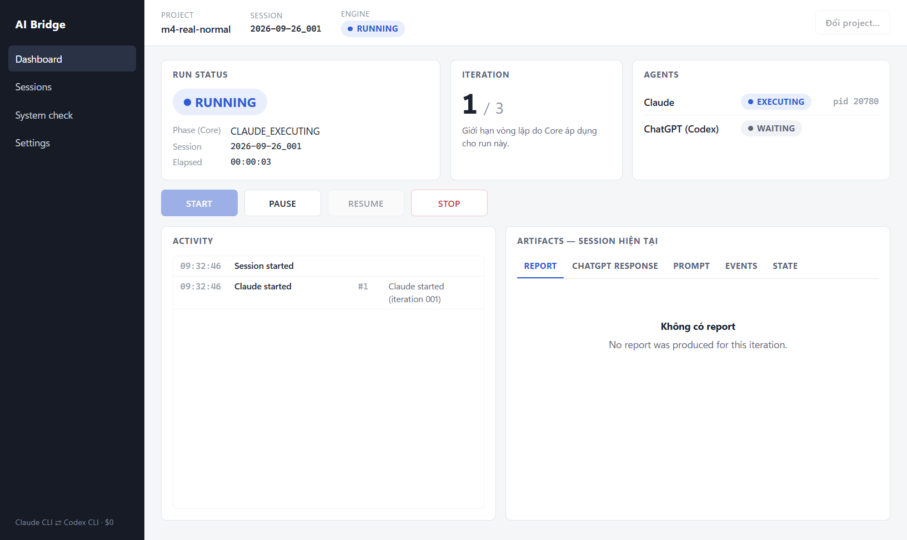

# AI Bridge — M4 Electron + React Desktop Report

**Filename note:** the spec asks for exactly `docs/11-m4-electron-react-report.md`, so that
name is used even though `11` is also the number of M3.5's
`docs/11-m3.5-electron-preparation-report.md` (different filenames — nothing overwritten).
User-facing UI text is Vietnamese; code, comments and docs are English (project convention).

## 1. Goal

Turn AI Bridge from a CLI/Core tool into a Windows desktop application (Electron + React)
while **Core (`BridgeEngine`) stays the single source of truth**: the UI contains no
orchestration, recovery, process management or state machine of its own — every decision
comes from Core.

Baseline re-verified before any change: M3.5 PASS
([docs/11-m3.5-electron-preparation-report.md](11-m3.5-electron-preparation-report.md)),
327/327 tests, `tsc --noEmit` clean, `doctor` PASS. There was no build script before M4
(Node runs `.ts` directly). The project folder is not a git repository, so before any edit
`src/ tests/ docs/ scripts/ package.json …` were backed up to
`D:\000_AI Agent\02-ai-brige-backup-pre-m4\` (outside the repo).

## 2. Architecture

```text
┌──────────────────────────────── AI Bridge.exe ────────────────────────────────┐
│                                                                                │
│  React Renderer (sandbox, contextIsolation, no Node)                          │
│    Dashboard · Activity · Artifacts · Sessions · System check · Settings       │
│        │  window.aiBridge  (16 fixed functions, frozen)                        │
│  Preload (preload.cjs — contextBridge, exposes only aiBridge)                  │
│        │  ipcRenderer.invoke('bridge:*') / on('bridge:event'|'bridge:snapshot') │
│  ─────────── Typed IPC: allowlist of 14 channels + payload validation ─────────│
│  Electron Main (main.mjs)                                                      │
│    ipc-router → sender check → channel allowlist → validate → handler          │
│    RunController (no Core logic; only calls BridgeEngine)                      │
│      ├── BridgeEngine (in-process): status · checkRecovery · pause · stop ·     │
│      │     reset · doctor · listSessions · getSessionArtifacts · recentEvents · │
│      │     getConfig · saveConfig · subscribe                                   │
│      └── fork ──► Run host (run-host.mjs, Electron-as-Node, 1 process per run)  │
│                     BridgeEngine.start() / resume()  ── subscribe → IPC events  │
│                        │                                                        │
└────────────────────────┼────────────────────────────────────────────────────────┘
                         ▼
                 Core: Orchestrator · State machine · Recovery · Lock · Integrity
                         │                          │
                    Claude CLI                  Codex CLI   (existing sign-ins, $0)
```

**Key architecture decision — the run host.** Core's `BridgeEngine.stop()` stops whichever
process holds the project's run lock by killing its whole process tree (`taskkill /T /F`),
and crash injection `process.exit()`s that same process. Running the loop inside the
Electron main process would therefore make STOP kill the app itself. So `start()`/
`resume()` execute in a dedicated child process (the run host: the Electron binary itself
with `ELECTRON_RUN_AS_NODE=1`, a variable the host deletes before Claude/Codex are
spawned). The run host holds the lock exactly the way the CLI process does, so Core's
stop/crash/recovery semantics apply **unchanged and without duplicating any logic**. All
other operations are called on `BridgeEngine` directly in Main. This is still "Electron
Main → BridgeEngine": the run host is part of the Main side, not a second orchestrator.

Dependencies point one way, desktop → Core. `tests/desktop/security.test.ts` enforces that
Core never imports `desktop/` and that `src/desktop/` contains no `new Orchestrator`,
`decideRecoveryStrategy`, `requestStop`, `killProcessTree`, `acquireLock` or `taskkill`.

### Core extensions made for M4 (per the contract's own rule: extend Core, don't work around it)

| Added to Core | Why |
|---|---|
| `BridgeEngine.checkRecovery()` | The UI offers RESUME only when Core says RECOVERABLE. Shares a private `planRecovery()` with `resume()` — still exactly **one** recovery decision in the codebase. |
| `listSessions()`, `getSessionArtifacts(runId)`, `recentEvents()` (`core/session-history/`) | Session History and the Artifact viewer read the existing on-disk layout through Core — no new database, Electron never reads `.ai-bridge/` itself. |
| `getConfig()` / `saveConfig()` | Settings store only fields Core supports, validated by Core's own `validateConfig`; refused while running. |
| `BridgeStatus.maxIterations`, `BridgeStatus.activity` (`core/status/agent-activity.ts`) | "Iteration 3 / 10" and Claude/Codex activity come straight from Core — the UI infers nothing. |
| `core/security/redact.ts` | Masks credential-shaped substrings in events/errors before they reach the UI. |

Full API: [docs/10-electron-integration-contract.md](10-electron-integration-contract.md) ("M4 additions").

## 3. Electron Main

`src/desktop/main/`:

- `main.ts` — `app.enableSandbox()`, single-instance lock, hardened `BrowserWindow` (§8),
  navigation/`window.open`/webview blocked, every permission request denied, no menu. At
  startup it reads the default project (`userData/settings.json`), validates it and calls
  `RunController.setProject` → Core `status()` + `checkRecovery()`; this is where recovery
  after a crash starts, and **nothing is ever resumed automatically**. Closing the app while
  a run *owned by this app* is active asks: Cancel / "STOP run và thoát" (STOP through Core).
  A run owned by the CLI is never touched.
- `run-controller.ts` — Main's single owner of "what is the app doing with this project":
  owns the run-host lifecycle, assembles one snapshot (status + recovery + controls +
  errors), forwards live events, polls `status()` every 1 s while active / 5 s idle, and
  pushes a snapshot only when something changed.
- `run-host.ts` / `run-host-entry.ts` / `run-host-protocol.ts` / `fork-run-host.ts` — the
  run host and its typed protocol (`start|resume` → `event*` → `outcome`); at most 8 KB of
  the host's stderr is kept for diagnostics.
- `ipc-router.ts` — sender check → allowlist → validation → handler → error redaction.
- `project-path.ts` — validates the project path (absolute, exists, a directory after
  `realpath`, not UNC, not a drive root).
- `app-settings.ts` — stores only `defaultProjectPath`; never any credential.

## 4. Preload

`src/desktop/preload/preload.ts` + `bridge-api.ts`: `contextBridge.exposeInMainWorld('aiBridge', …)`
with **16 fixed functions** (14 invokes + `onEvent`/`onSnapshot`), `Object.freeze`d. Not
exposed: `ipcRenderer`, generic `invoke/send/on`, `require`, `process`, `fs`,
`child_process`, `shell`. Push listeners receive only the payload — never Electron's IPC
event object (which would leak `sender`). Every `onX()` returns an idempotent unsubscribe.
The preload is bundled as CommonJS (required for sandboxed preloads).

## 5. IPC

Typed contract in `src/desktop/shared/ipc-contract.ts` (`InvokeContract` maps channel →
request/response; `PushContract`). No `any`. Two deliberate, commented casts: `ipc-router`
(TypeScript's correlated-union limitation) and `bridge-api` (restoring type information IPC
serialization erases).

| Channel | Request | Notes |
|---|---|---|
| `bridge:getSnapshot` | — | consolidated snapshot from Core |
| `bridge:start` | `{ task: string (1–20 000 chars, no NUL), maxIterations?: 1–1000 }` | unknown fields rejected |
| `bridge:pause` / `resume` / `stop` / `discard` | — | Main re-checks Core-derived controls before calling |
| `bridge:doctor` | — | `BridgeEngine.doctor()` (redacted) |
| `bridge:getRecentEvents` | `{ limit: 1–1000 }` | |
| `bridge:listSessions` | — | |
| `bridge:getSessionArtifacts` | `{ runId: YYYY-MM-DD_NNN }` | no path traversal (validated in Main *and* Core) |
| `bridge:selectProject` | — | native folder picker in Main; the renderer never sends a path |
| `bridge:getSettings` / `saveProjectConfig {config}` / `setDefaultProject {clear}` | | Core validates config |
| push `bridge:event`, `bridge:snapshot` | | Main → renderer |

Main registers handlers only by looping over the allowlist (no `ipcMain.on`); requests from
any frame other than the bundled renderer page are rejected (`UNTRUSTED_SENDER`); unknown
channel → `UNKNOWN_CHANNEL`; bad payload → `INVALID_REQUEST`; a throwing handler →
redacted `UNEXPECTED`, never a stack trace.

## 6. React Renderer

React 19, no Redux/Zustand. `BridgeProvider` (Context) holds **one** subscription to
`onSnapshot`/`onEvent` (subscribe on mount, unsubscribe on unmount), the latest snapshot
from Main, and the activity list (max 500, de-duplicated, time-ordered). Local UI state is
limited to: selected view/tab, modal, selected iteration, rendered/raw, log "follow" mode.
The START/PAUSE/RESUME/STOP controls are **computed in Main** (`shared/controls.ts`) from
Core's status + `checkRecovery()`; the renderer only displays `snapshot.controls`.

Report Markdown is rendered by a small in-house renderer (`lib/Markdown.tsx`) that builds
React elements — no `dangerouslySetInnerHTML`; HTML inside a report is shown as text.

## 7. UI

- **Header:** project, session, Engine state; pick/switch project (locked while running).
- **Run status:** Core's status (`RUNNING`/`PAUSED`/`INTERRUPTED`/`DONE`/…), Core's exact
  phase (`CLAUDE_EXECUTING`, `REPORT_VALIDATED`, …), session, elapsed time.
- **Iteration:** `n / max` (max from Core; `—` for pre-M4 state files).
- **Agents:** Claude `EXECUTING/WAITING/IDLE`, ChatGPT (Codex) `REVIEWING/WAITING/IDLE` from
  Core's `status.activity`; a PID is shown only while that agent is active.
- **Controls:** START / PAUSE / RESUME / STOP per the spec's §8 table. PAUSED: RESUME + STOP
  (STOP there ends the session via Core `reset()`, artifacts kept, with confirmation).
- **Recovery banner:** "Có session chưa hoàn tất. Session … Iteration … Status RECOVERABLE
  [RESUME] [DISCARD]", or "RECOVERY BLOCKED" + Core's reason (no RESUME).
- **Activity:** timestamp · event type · iteration · message; warning/error rows
  highlighted; auto-scroll that stops when the user scrolls up, with a "follow latest" button.
- **Artifacts (read-only):** REPORT (Rendered/Raw, "hash verified" badge), CHATGPT RESPONSE,
  PROMPT (exactly what was sent to Claude + check against `claudeInputHash`), EVENTS, STATE (JSON).
- **Sessions:** Session ID · Project · Start · End · Status · Iteration · Result; clicking a
  row opens that session's artifacts.
- **System check:** Core's real `doctor()` result.
- **Settings:** default project; `.ai-bridge/config.json` (maxIterations, timeouts,
  reportMaxBytes, two git flags) validated/written by Core; log info (read-only); an
  explicit "no credentials stored" statement.
- **Errors:** short title + plain message (e.g. "Claude CLI không khả dụng", "Authentication
  unavailable", "Project đang được session khác sử dụng", "Session recovery bị chặn",
  "Report không hợp lệ", "ChatGPT response không hợp lệ", "Process timeout", "Unknown
  error"); technical detail only behind "View details".

Screenshots from the real runs: [dashboard running](assets/m4/dashboard-running.png) ·
[paused](assets/m4/paused.png) · [recovery after app restart](assets/m4/recovery-after-restart.png) ·
[stopped](assets/m4/stopped.png) · [sessions](assets/m4/sessions.png) ·
[system check](assets/m4/system-check.png) · [settings](assets/m4/settings.png).



## 8. Security

| Requirement | Status | Evidence |
|---|---|---|
| `contextIsolation: true` | ✅ | static test + real smoke |
| `nodeIntegration: false` | ✅ | static test; real smoke: `typeof require/process/module/Buffer/global` = `undefined` in the real renderer |
| `sandbox: true` | ✅ **fully**, no relaxation needed — the preload is CJS and uses no Node API; plus `app.enableSandbox()` | static test |
| Expose only what's needed | ✅ 16 functions, frozen, no invoke/send | unit test + real smoke |
| IPC allowlist; reject unknown channels / invalid input | ✅ | 11 IPC tests + real smoke (empty task, extra `command` field, runId `../../state` all rejected by Main) |
| No eval / new Function / remote / dangerouslySkipPermissions | ✅ | static test; CSP `script-src 'self'` blocks `Function('return process')` in the real app |
| Navigation / window.open / webview / permissions | ✅ blocked | real smoke |
| CSP | `default-src 'none'; script-src 'self'; style-src 'self'; connect-src 'none'; …`, no `unsafe-*` | static test |
| No credential exposure/storage; redacted logs | ✅ `redactSecrets` on events/errors/doctor details; settings hold only `defaultProjectPath` | unit tests; scan of all real-run outputs: no credential-shaped strings |
| No network / telemetry | ✅ no `fetch`/`XMLHttpRequest`/`WebSocket`/http(s) URL in `src/desktop`; CSP `connect-src 'none'` | static test |
| Renderer imports only *types* from Core | ✅ | static test |

## 9. Testing

`pnpm test` = `node --import ./tests/support/register-tsx.mjs --test "tests/**/*.test.ts" "tests/**/*.test.tsx"`
(a tiny module hook uses esbuild so Node can load `.tsx`; `.ts` is still Node's own type stripping).

**411/411 PASS** (327 existing + 84 new); `pnpm typecheck` PASS (root tsc + `tsconfig.renderer.json`).

| New test file | Tests | Covers |
|---|---|---|
| `tests/bridge-engine-m4.test.ts` | 18 | new status fields; checkRecovery (NONE/RECOVERABLE/BLOCKED/RUNNING, agreeing with resume); 3 Core regressions; session history/artifacts/overwritten report; runId traversal; recentEvents + torn line; config |
| `tests/agent-activity.test.ts`, `tests/redact.test.ts` | 4 + 4 | Core helpers |
| `tests/desktop/ipc.test.ts` | 11 | valid/invalid requests, unknown channel, untrusted sender, validation, responses, redaction, no stack traces |
| `tests/desktop/controls.test.ts` | 10 | START/PAUSE/RESUME/STOP for every state + the early-pause regression |
| `tests/desktop/preload-api.test.ts` | 4 | API surface, exact channels, no `sender` leak, no listener leak |
| `tests/desktop/run-controller.test.ts` | 6 | **integration: Main ⇄ real forked run host ⇄ BridgeEngine** (fake CLIs): start, pause, resume, stop (process tree verified dead), status, subscribe, crash → "app restart" → resume with hash continuity, blocked recovery |
| `tests/desktop/project-path.test.ts` | 3 | path validation, app settings |
| `tests/desktop/security.test.ts` | 8 | security config, IPC registration, preload, no Node in renderer, no Core logic in desktop, no network |
| `tests/desktop/renderer/*.test.tsx` (happy-dom) | 8 + 4 + 4 | status render, button enable/disable, event update, iteration update, error + View details, session display, recovery banner; listeners: mount/mount/unmount/mount, StrictMode, 25 cycles without leaks, 500-row bound; Markdown never injects HTML |

## 10. Real integration tests

Run with `scripts/desktop/real-e2e.ts`: it launches the **real Electron app** and drives the
real renderer over the Chrome DevTools Protocol (127.0.0.1) — clicking the same buttons a
user clicks (START → type task → submit, PAUSE, RESUME, STOP + confirm) — against the
**real Claude CLI and Codex CLI** (existing subscription / ChatGPT sign-in). Each test uses a
fresh git sandbox `sandbox/m4-real-*`. Results + screenshots: `sandbox/m4-real-results/<scenario>/`.

| Test | Result | Details |
|---|---|---|
| **A — Normal** | ✅ 4/4 | UI START → RUNNING → Claude → valid report → Codex → DONE (Codex judged DONE after 1 iteration); 9 live events rendered. |
| **B — Multi iteration** | ✅ 6/6 (2nd attempt) | 1st attempt 4/5: *real* Codex judged DONE after iteration 1 because the report described part 2 as "only if the reviewer asks" (the reviewer only sees the report — correct behaviour, not a bug). Task reworded to state the unfinished goal, fresh sandbox: **2 real iterations** Claude→Codex→Claude→Codex→DONE; iteration-2 prompt byte-identical to Codex's PROMPT (SHA-256 `f008d87e…`). |
| **C — Pause/Resume** | ✅ 4/4 (+ 4/4 again on the packaged exe after fixing bug #8) | PAUSE clicked during `CLAUDE_EXECUTING`: Claude **not killed**; Core finished iteration 1 and PAUSED; RESUME enabled only because Core said RECOVERABLE; resume → DONE; prompt after resume == prompt persisted before the pause (SHA-256 `88609203…`; packaged `e385800e…`). |
| **D — Crash recovery** | ✅ 7/7 | `AI_BRIDGE_CRASH_AT=AFTER_PROMPT_PERSISTED`: real run-host crash (exit 137), UI shows "Core process kết thúc bất thường", state INTERRUPTED + RECOVERABLE; **Electron fully closed and relaunched**: banner "Có session chưa hoàn tất … RECOVERABLE", nothing auto-resumed; banner RESUME → DONE in the same session; prompt sent after recovery == pre-crash `promptHash` (`e66e8f3d…`). |
| **E — Stop** | ✅ 4/4 | Long task; while Claude ran, the run host's process tree was captured (**46 processes**: run host, `claude.exe`, and the MCP servers/hooks Claude spawns — node, python, serena, headroom, bash…). STOP (+ confirm): session STOPPED, no error, not offered for resume; **all 46 PIDs gone — no orphan**; lock released. |
| **Packaged exe** | ✅ smoke 10/10 (twice) + multi 6/6 + pause 4/4 | `release/AI Bridge-win32-x64/AI Bridge.exe`: the run host works in packaged form; 2 real iterations (`910021f0…`). |
| **Desktop smoke (dev)** | ✅ 10/10 | `scripts/desktop/smoke.ts`: no Node in renderer, API surface, CSP, IPC validation, navigation/popup blocked, snapshot, real `doctor()` over IPC. |

Afterwards: no `electron.exe`/`AI Bridge.exe` left running, no leftover locks in any
sandbox, no credential-shaped strings in any event/log/artifact/result.

To re-run: `node scripts/desktop/smoke.ts <project> [--exe <exe>]` and
`node scripts/desktop/real-e2e.ts <normal|multi|pause|recovery|stop> sandbox/<dir> [--exe <exe>]`
(consumes real subscription quota; sandboxes only).

## 11. Build

- `pnpm build` — esbuild → `dist-desktop/` (`main.mjs` ESM, `preload.cjs` CJS,
  `run-host.mjs`, `renderer/{index.html,app.js,app.css}`).
- `pnpm desktop` — dev build + launch Electron.
- `pnpm package:win` — build + `@electron/packager` → **portable**
  `release/AI Bridge-win32-x64/AI Bridge.exe` + `release/AI-Bridge-win32-x64-0.1.0-portable.zip`
  (150.9 MB). The app contains only `package.json` + `dist-desktop/` (no src/tests/sandbox/
  node_modules — every dependency is bundled). No installer, no code signing, no
  auto-update, no upload.
- New dependencies (all devDependencies, bundled at build time, free/MIT):
  `electron@44.4.5`, `react@19.3.0`, `react-dom@19.3.0`, `@types/react`, `@types/react-dom`,
  `esbuild@0.28.2` (bundler + `.tsx` transform for tests), `happy-dom@20.14.5` (DOM for
  renderer tests), `@electron/packager@20.3.0`. No Vite (Vite 8 is rolldown-based; esbuild
  alone is enough and smaller), no state framework, no Markdown library.

## 12. Bugs found

1. **Core — a stale pause marker survives a run** (found while designing): a pause requested
   before a crash/forced stop made the *next* `start` pause immediately at PREFLIGHT →
   an un-resumable session.
2. **Core — STOP recorded as a crash**: after `stop()` force-killed the run, the state file
   was left mid-phase → `INTERRUPTED` → the UI would show "RECOVERY BLOCKED"/offer resume
   for a deliberate stop.
3. **Core — `resume()` ignored the run's `maxIterations`** (used the config default, e.g.
   10 instead of the 3 the run was started with).
4. **Core (design) — `.ai-bridge/reports/NNN-report.md` is shared by all sessions**: an older
   session's viewer would show a later session's report.
5. **Architecture** — running the loop inside Electron Main would make Core's `stop()` kill the app.
6. **Renderer performance** — every event re-rendered the whole log (620 events: 140 s in the test DOM).
7. **Markdown** — `SESSION_ID: 2026-09-26_001` rendered as italics (`_` inside words).
8. **Early PAUSE** (found through an intermittently failing integration test — not waved
   away as flaky): PAUSE right after START, while Core was still at PREFLIGHT, paused at
   iteration 0 → Core (correctly) blocks recovery → the user loses the run.
9. **Quitting the app could STOP a CLI-owned run**: the quit dialog applied to any RUNNING
   run, including one this app did not start.
10. **UX** — the REPORT tab said "No report was produced" while Claude was still working on that iteration.
11. **UX** — after a crash, the Agents card showed dead PIDs next to IDLE.
12. Test tooling: the e2e script clicked START before React rendered (script race); the
    static security test flagged the word "bypassPermissions" inside UI help text.

## 13. Bugs fixed

| # | Fix | Test |
|---|---|---|
| 1 | Core `start()`/`resume()` clear the pause marker once they hold the lock | regression in `bridge-engine-m4.test.ts` |
| 2 | Core `stop()`: once the process is confirmed gone and state is not terminal → write `STOPPED` + `RUN_STOPPED` event (+ clear pause marker) | regression + integration + real Test E |
| 3 | Core persists `maxIterations` in state; `resume()` reuses it (older state files → config, as before) | regression |
| 4 | Read side: a report is returned from the shared file only when its hash/content proves it belongs to the session; otherwise it is recovered from `NNN-chatgpt-input.md` (what was actually sent to Codex), with a source/verified badge. *Storage layout unchanged* (§14) | "overwritten report" test |
| 5 | Run host process (§2) | integration + real tests |
| 6 | `React.memo` per activity row (140 s → 21 s in happy-dom dev mode) | 500-row bound test |
| 7 | Emphasis only at word boundaries | Markdown regression |
| 8 | PAUSE offered only once Core reports iteration ≥ 1 (where a pause always lands on a resumable checkpoint); Core's pause semantics unchanged | controls regression; 5 consecutive green runs; real pause re-run on the packaged exe |
| 9 | `ownsActiveRun()` — the quit dialog only applies to runs this app owns | code review |
| 10, 11 | "Waiting for report" for the live iteration; PID shown only while an agent is active | renderer tests |
| 12 | Script waits for an enabled button; UI text reworded | — |

## 14. Known limitations

1. **Runs not started by this app instance** (from the CLI, or a run host still alive after
   an Electron Main crash): the app sees `RUNNING` and PAUSE/STOP work through Core, but
   there is **no live event stream** (status polling + event history only). The "Electron
   Main crashes while the run host survives" scenario was not tested for real — only a crash
   of the Core process was (Test D).
2. The "STOP run và thoát" quit dialog is a native dialog — code-reviewed, not automated.
3. STOP on Windows takes ~10 s (Core tries a graceful stop before the force-kill —
   unchanged M2/M3 Core behaviour).
4. `PROMPT_SENT` and `ITERATION_COMPLETED` exist in `EVENT_TYPES` but Core does not emit
   them, so the UI shows no "Prompt persisted / Prompt sent / Iteration completed" rows;
   the equivalent moments appear as "Response parsed"/"Claude started". The UI never
   invents events.
5. PAUSE is not offered before iteration 1 starts (deliberate, bug #8); the CLI still allows it.
6. Reports share one folder across sessions (bug #4) — mitigated on the read side only;
   Core's storage layout was not changed.
7. Artifact viewer caps each file at 512 KB (`truncated` flagged); the activity log keeps at most 500 events.
8. `asar: false`, and Electron's `RunAsNode` fuse must stay enabled (the run host needs
   it). No code signing → Windows SmartScreen may warn. No installer/auto-update (out of scope).
9. On this machine pnpm did not run Electron's postinstall; `node node_modules/electron/install.js` was needed once.
10. `tsconfig.renderer.json` includes Node types because type-only imports reach into Core;
    runtime isolation is enforced by the sandbox + static tests, not by types.
11. "Permissions" and "Core" from the spec's System Check list are not separate `doctor`
    checks; the UI shows Core's real checks (no second doctor was written).
12. Per-run timeouts: Core's `start()` does not accept them → the Start dialog shows the
    project's timeouts read-only; they are edited in Settings (project config).
13. One window / one project at a time; projects on UNC/network shares are rejected.

## 15. Electron readiness

| Question | M3.5 | M4 |
|---|---|---|
| Can Electron call Core directly? | YES (API) | **YES — built**: Main + run host only call `BridgeEngine` |
| Can the UI subscribe to events? | YES | **YES** — live over IPC push, one listener, no duplicates |
| Can the UI display progress? | YES | **YES** — status/phase/iteration/agents from Core |
| Can the UI pause/resume/stop? | YES | **YES** — real tests C, E |
| Can the UI recover after restart? | YES | **YES** — real test D |
| Can the UI display logs/artifacts? | YES | **YES** — activity + 5 artifact tabs + sessions |
| Windows build? | — | **YES** — portable exe + zip, tested for real |

## 16. Cost

**$0 extra.** No OpenAI API, no Anthropic API, no API key, no cloud backend, no cloud
database, no telemetry/analytics, no ChatGPT/Claude Desktop UI or browser automation, no MCP
chat simulation. The app makes no network calls of its own (CSP `connect-src 'none'`,
static test). Real tests used the Claude CLI + Codex CLI with the existing subscription /
ChatGPT sign-ins (`doctor`: `claude-auth` subscription, `codex-auth` ChatGPT,
`api-key-env` PASS). All new dependencies are free open source; the only downloads were
npm packages and the Electron binary at install time.

## 17. Final status

**M4 STATUS: PASS**

- Architecture: Electron Main uses `BridgeEngine`; the renderer has no Core logic; IPC is
  typed; the preload is secure; no second orchestration (static tests + review).
- Security: `contextIsolation` ON, `nodeIntegration` OFF, `sandbox` ON (fully), IPC
  allowlist, no Node APIs exposed, no credentials exposed (unit + static + real smoke).
- UI: Dashboard, Run status, Iteration, Claude status, ChatGPT/Codex status, START, PAUSE,
  RESUME, STOP, Activity log, Session history, Artifact viewer, System check, Settings.
- Recovery: session recovery, pause/resume, crash recovery without corrupting state — all tested for real.
- Testing: 411/411 tests (327 existing + 84 new), typecheck PASS, build PASS, 5/5 real
  integration tests PASS (+ dev/packaged smoke 10/10, real multi + pause on the packaged exe).
- Cost: $0.

### Files changed

**New — Core:** `src/core/session-history/session-history.ts`, `src/core/status/agent-activity.ts`,
`src/core/security/redact.ts`.
**Modified — Core:** `src/core/bridge-engine.ts` only (checkRecovery/planRecovery,
listSessions, getSessionArtifacts, recentEvents, getConfig/saveConfig,
status.maxIterations/activity, 3 bug fixes, exported `MAX_LOG_FILE_BYTES`).
**New — Desktop:** `src/desktop/shared/{ipc-contract,controls,messages}.ts`;
`src/desktop/main/{main,run-controller,run-host,run-host-entry,run-host-protocol,fork-run-host,ipc-router,project-path,app-settings,redaction}.ts`;
`src/desktop/preload/{preload,bridge-api}.ts`;
`src/desktop/renderer/{index.html,styles.css,main.tsx,global.d.ts}`,
`renderer/state/BridgeProvider.tsx`, `renderer/lib/{Markdown.tsx,events-store.ts,format.ts}`,
`renderer/components/{App,Dashboard,RunPanel,RunControls,RecoveryBanner,ActivityLog,ArtifactViewer,SessionHistory,SystemCheck,Settings,StartRunDialog,common}.tsx`.
**New — Scripts:** `scripts/desktop/{build,package-win,cdp,smoke,real-e2e}.ts`.
**New — Tests:** `tests/{bridge-engine-m4,agent-activity,redact}.test.ts`,
`tests/desktop/{ipc,controls,preload-api,project-path,run-controller,security}.test.ts`,
`tests/desktop/renderer/{renderer,listeners,markdown}.test.tsx`, `tests/desktop/renderer/{dom-setup.ts,harness.tsx}`,
`tests/support/{register-tsx,tsx-hooks}.mjs`, `tests/fixtures/desktop/fake-run-host.ts`.
**Modified — Tests:** `tests/fixtures/fake-claude/fake-claude.mjs` (optional `FAKE_CLAUDE_DELAY_MS`).
**Config:** `package.json` (scripts `doctor/test/typecheck/build/desktop/package:win`,
`main`, devDependencies, `pnpm.onlyBuiltDependencies`), `pnpm-lock.yaml`, `tsconfig.json`
(adds `scripts/`, excludes the renderer), new `tsconfig.renderer.json`, `.gitignore`
(`dist-desktop/`, `release/`).
**Docs:** this report; `docs/10-electron-integration-contract.md` (M4 additions),
`docs/04-architecture-current.md`, `docs/05-cli-reference.md` (new stop semantics),
`README.md`, `docs/assets/m4/*.png`.
