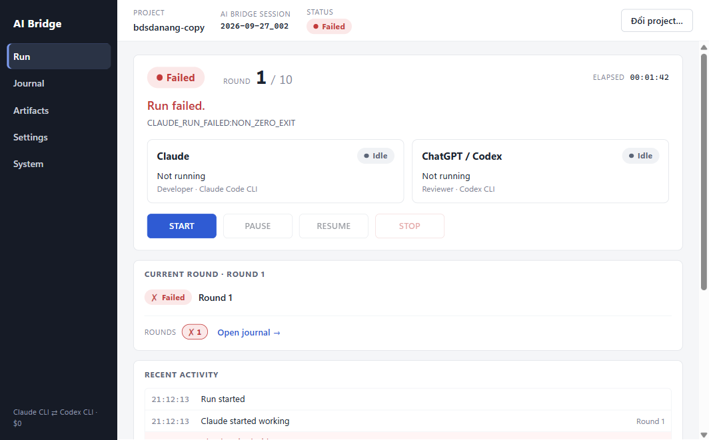
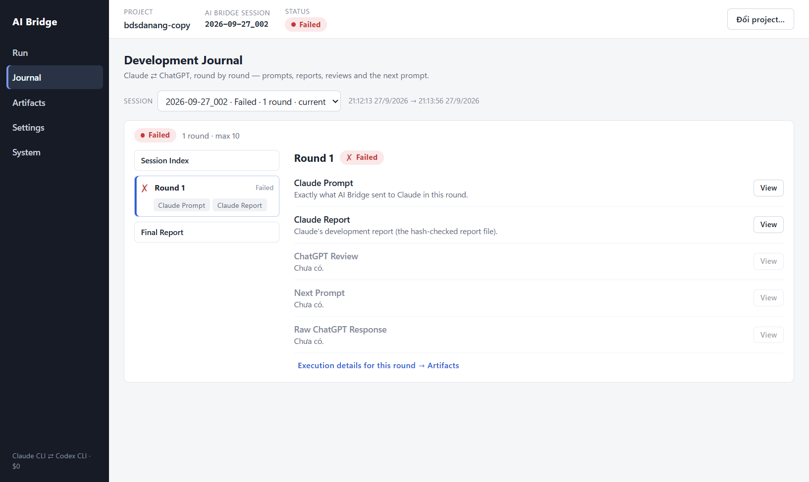
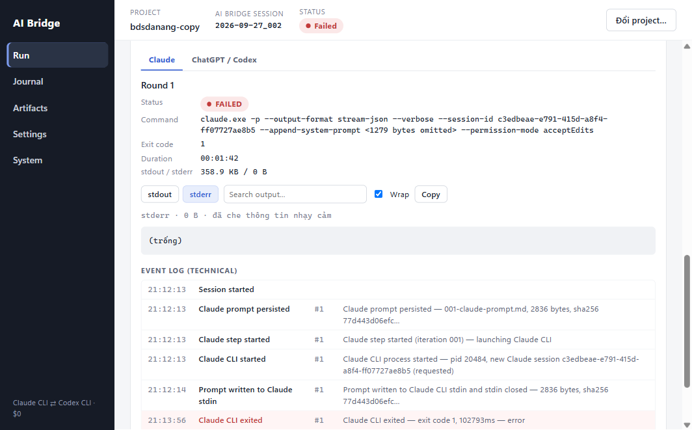
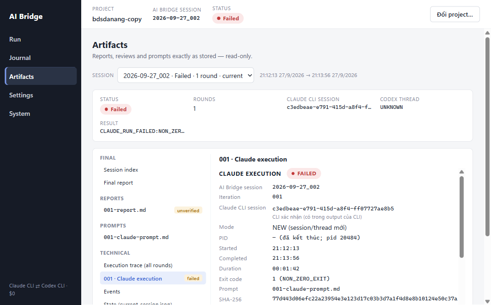

# AI Bridge — UI/UX Refactor (Information Architecture) Report

## Executive Summary

The desktop renderer is reorganised around five screens — **RUN**, **JOURNAL**,
**ARTIFACTS**, **SETTINGS**, **SYSTEM** — so a user can see what AI Bridge, Claude and
ChatGPT/Codex are doing within a few seconds, while every piece of technical information
(Core phase, session ids, PIDs, M4.1 execution records, raw stdout/stderr, the full event
log) stays available one click away. This is a presentation-layer change: no Core, IPC
channel, preload, recovery, journal-generation or report-contract behaviour was changed.
Every human-readable sentence is picked from a fixed table keyed by Core's own values.

- `pnpm test`: **535/535 pass** (462 baseline + 14 new/rewritten renderer tests + 59
  `tests/providers` tests added concurrently by a separate M4.3 session — see "Concurrent
  work" below).
- `pnpm typecheck`: renderer config clean; root config clean for everything in this change.
  The only error is in `tests/providers/claude-code-provider.test.ts` (the M4.3 session's
  file, not part of this work).
- `pnpm build`: succeeds. Desktop smoke test (`scripts/desktop/smoke.ts`) against the real
  Electron app: **10/10 checks pass**.

## Baseline

Before any change: 462/462 tests pass, both TypeScript configs clean (2026-09-27).

The previous renderer had four views (Dashboard / Sessions / System check / Settings). The
Dashboard put run status, iteration, agents with PIDs and CLI session ids, controls, the
full technical activity log and an eight-tab artifact viewer (REPORT, CHATGPT RESPONSE,
PROMPT, CLAUDE EXECUTION, CODEX EXECUTION, JOURNAL, EVENTS, STATE) on one screen. The
backend already delivered everything needed; the problem was layering.

## Data flow (unchanged)

`BridgeEngine` → Electron Main (`run-controller`, snapshot + event push) → typed IPC
allowlist (`ipc-contract.ts`, validated in Main) → frozen preload API (19 functions) →
React (`BridgeProvider`: one snapshot subscription + bounded event list). The refactor only
consumes what already crosses that boundary: `BridgeSnapshot` (status, phase, iteration,
activity, controls, recovery, lastError), `BridgeEvent`s, `listSessions`,
`getSessionArtifacts`, `getJournal`/`getJournalEntry`, `getExecutionOutput`, `doctor`,
`getSettings`. No new channel, no new preload function, no new backend state.

## Information Architecture

| Screen | Answers | Contents |
|---|---|---|
| **Run** | What is happening right now? | Status, round x / max, elapsed, one activity sentence, Claude and ChatGPT/Codex tiles, START/PAUSE/RESUME/STOP, current-round card (live stepper or recorded outcome + round chips), plain activity feed. Collapsed: **Technical details**, **Technical output**. |
| **Journal** | What happened, round by round? | Session picker; round timeline (✓ completed, ● running, ✗ failed, ○ pending); round detail with View for Claude prompt / Claude report / ChatGPT review / next prompt / raw response; session index; final report. |
| **Artifacts** | What files were produced? | Session picker + facts (status, rounds, Claude CLI session, Codex thread, result); file tree grouped **Final / Reports / Reviews / Prompts / Technical**; read-only viewer (Markdown rendered/raw, hash badges). |
| **Settings** | How is the project configured? | Open/default project; `.ai-bridge/config.json` (review rounds, timeouts with live minute hints, report size, safety checks). |
| **System** | Is the environment ready? | Core `doctor` grouped Claude Code / ChatGPT-Codex / Project / Environment; app runtime (Electron, Chromium, platform); log handling; security & cost statement. |

### Where things live now

- **Technical output (raw CLI):** Run → *Technical output* (current round, per agent:
  stdout / stderr, process facts, full technical event log of the session) and in every
  execution record (Run → *Technical details*, Artifacts → Technical → `NNN · Claude/Codex
  execution`) via VIEW CLI OUTPUT / VIEW STDERR.
- **Execution records (M4.1):** Run → *Technical details* for the current round; Artifacts
  → Technical for every round; Artifacts → Technical → *Execution trace* for the
  per-iteration table.
- **Journal history (M4.2):** Journal screen (any session via the picker). Round chips on
  Run link straight to that round.
- **Artifacts:** Artifacts screen; reports, reviews, prompts, the journal's session index /
  final report, events and `current-session.json` state.

## RUN screen

- **Status / round / elapsed** from `BridgeStatus`. The status pill shows a friendly word
  (Running, Completed, Failed…) and keeps the raw Core value in its tooltip.
- **Activity sentence** (`lib/run-summary.ts → describeHeadline`) — a fixed sentence per
  Core status and, while RUNNING, per `currentPhase`: e.g. `CLAUDE_EXECUTING` → "Claude is
  working on the task." (round 1) or "Claude is working on the changes ChatGPT requested in
  round N−1." (round ≥ 2 — structurally true: from round 2 Claude's prompt is byte-for-byte
  the PROMPT block ChatGPT returned), `CODEX_REVIEWING` → "ChatGPT is reviewing Claude's
  report.", any unknown phase → "Processing…". Notes come from real state only: a pending
  pause, a run owned by another process, `lastError.title`, or — after a restart when this
  app instance has no `lastError` — the `detail` Core wrote on the session's own final
  RUN_COMPLETED / RUN_STOPPED event (the errorCode / stop reason). No percentages, no
  claims about what the model is doing inside a step.
- **Agent tiles** (`describeAgent`) map Core's `activity` (IDLE/WAITING/EXECUTING/REVIEWING,
  already derived in Core by `describeAgentActivity`) plus the phase to a short line
  ("Waiting for Claude's report", "Reviewing Claude's report for round 2").
- **Current round** (`roundSteps`): while RUNNING inside a round, a 4-stage stepper (Claude
  works → Report validated → ChatGPT reviews → Verdict) positioned by the phase; otherwise
  the round's recorded state + verdict from the journal index. Round chips list every round
  so far and open it in Journal.
- **Recent activity** — plain-language feed of the current session's milestone events
  (`humanizeEvent`). Pipe/process-level events (`PROMPT_PERSISTED`,
  `CLAUDE_PROCESS_STARTED`, `PROMPT_SENT`, `CODEX_PROCESS_STARTED`) are left out of the feed
  but remain in the technical event log. Warning/error rows carry Core's detail line.
- **Technical details** (collapsed, mounted only when opened): Core state (status, phase,
  session, iteration, started/updated, live-events flag, last report path), CLI processes
  (PIDs only while Core reports the agent active, as before; Claude CLI session; Codex
  thread) and the current round's `ExecutionPanel`s (unchanged M4.1 lifecycle/evidence).
- **Technical output** (collapsed): per agent tab — command (redacted argv), exit code,
  signal/timeout, duration, stdout/stderr byte counts; `CliOutput` viewer; the full
  technical event log of the session.

## Raw CLI output (`CliOutput`)

Shared by the execution panels and Run → Technical output. Uses the existing
`getExecutionOutput` IPC call: the redacted **tail** (≤ 256 KB, `MAX_OUTPUT_TAIL_BYTES`),
fetched only on click — nothing streamed, the bounded design is unchanged. Controls:
stdout/stderr toggle, line search (filters client-side, shows matching line numbers and a
count), wrap toggle, copy, scrolling. Copy tries the clipboard API first; Electron Main
denies all permission requests by design, so it falls back to selecting the text and the
gesture-based copy command, and if that is unavailable it leaves the text selected and
says "press Ctrl+C". Main's permission handler was **not** changed.

## JOURNAL screen

Reuses the M4.2 journal as-is (`getJournal` index + lazily loaded `getJournalEntry`).
Nothing is fetched until the user picks an entry; the default right pane is the latest
round's detail (a listing only). Round entries are ordered as they happen (prompt → report
→ review → next prompt; raw response last). A missing next prompt after a DONE/NEED_HUMAN
verdict is explained ("reviewer ended the run in this round"). Upcoming rounds are shown as
*Pending* only while the session can still continue (RUNNING / PAUSED / INTERRUPTED), at
most three plus an "up to round N" note — never a list of 100 placeholders.

## ARTIFACTS screen

The eight-tab viewer became a grouped file tree built only from `getSessionArtifacts` +
the journal index (an entry is listed only if it exists; reports are always listed with
their real availability: verified / unverified / missing / overwritten). Labels are the
real file names. Every former tab body is preserved: rendered/raw report with the hash
badge and the CODEX_INPUT recovery note, the exact Claude prompt with the
`claudeInputHash` match line, raw ChatGPT response, readable review, next prompt, Codex
input, Claude/Codex execution records, execution trace (click a row → that round's Claude
execution), events, state. Former Sessions page data (Claude CLI session, Codex thread,
error code / recovered) is in the session facts bar.

## SETTINGS / SYSTEM

Settings keeps exactly the fields and save path it had (`saveProjectConfig`, validated by
Core); the Logs and Security & cost cards moved to System. System groups the doctor checks
(unknown future checks land under "Other"), shows Electron/Chromium versions parsed from
the renderer's own `navigator.userAgent` and `navigator.platform` (no new IPC; Core's Node
version is the doctor's `node` check), log rotation (from `getSettings`) and the security
statement. Authentication status is exactly what the CLIs' own status commands reported to
the doctor; no credential is read, stored or displayed.

## Visual design

Same palette and tokens; narrower sidebar (176 px); one dominant hero card on Run;
restrained cards; status colour used only semantically; consistent Pill tones; collapsed
technical sections; `min-width: 0` / `overflow-wrap` on all grids, long ids and paths.
Verified at the minimum window size (1080 × 700 window ≈ 1064 × 661 content) with the real
app: **0 px horizontal overflow** on Run and Artifacts; logs, trees and viewers scroll
inside their panels.

## Accessibility / usability

`aria-current` on nav and selected tree items, `aria-expanded`/`aria-controls` on
disclosures, `aria-pressed` on view toggles, `aria-live="polite"` on the activity
sentence, `aria-label`s on round chips/heads, visible focus rings on every interactive
element (including tree items, round chips, disclosures, scrollable logs), `title`
tooltips for truncated ids and raw Core values, disabled states unchanged (from
`snapshot.controls`).

## Security

Unchanged: `contextIsolation`, `nodeIntegration=false`, `sandbox`, CSP, the IPC allowlist
and payload validation, the frozen 19-function preload, navigation/popup denial, the
permission handler, redaction. Renderer still has type-only imports from Core, no
`fetch`/network, no HTML injection (all asserted by `tests/desktop/security.test.ts`; one
parameter was renamed from `fetch` to `load` so the textual network scan stays strict).
The smoke test re-verified isolation, preload surface, CSP, IPC rejection, navigation lock
and the real doctor from inside the rebuilt app.

## Tests

Renderer tests: 28 → 42.

- `tests/desktop/renderer/ui-refactor.test.tsx` (new, 11): headline/agent/stepper mapping
  for every status and phase; feed vs technical events; RUNNING, DONE, PAUSED and ERROR
  screens; feed shows only the current session's milestone events while Technical output
  keeps all of them; raw output per agent loaded on demand + search; round chip → Journal
  round detail; System grouping + runtime; Settings contains configuration only.
- `tests/desktop/renderer/execution.test.tsx` (rewritten, 7 → 10): artifact tree groups
  and real file names; Claude execution record (ids, pid, exit code, SHA, evidence
  lifecycle); stderr/stdout via the dedicated IPC call + search; journal lists rounds and
  lazy-loads exactly one entry; round detail; pending rounds only for open sessions;
  review / raw response / next prompt as separate entries; continuity UNKNOWN; missing
  Codex record said honestly (and nothing technical fetched while collapsed); Artifacts
  facts + execution trace.
- `tests/desktop/renderer/renderer.test.tsx` (updated): status/round/activity/agents, phase
  + PID under Technical details, live snapshot update, controls, events, error details,
  recovery banner, Artifacts session + files, no-project state.
- `tests/desktop/renderer/input.ts` (new helper): form-control `change()`.
- `scripts/desktop/smoke.ts`, `scripts/desktop/real-e2e.ts`: selectors updated to the new
  navigation (same checks). `real-e2e.ts` was **not** run (it spends real Claude/Codex
  quota); only its selectors changed.

Results: `pnpm test` 535/535 · renderer typecheck 0 errors · `pnpm build` OK · smoke 10/10
(real Electron, run against a temporary copy of a real project's `.ai-bridge` data; the
doctor reported `claude-auth: FAIL` on this machine at the time — an environment state,
not a test failure).

## Files Changed

New: `src/desktop/renderer/components/{RunView,JournalView,ArtifactsView,SystemView,TechnicalDetails,CliOutput,SessionPicker}.tsx`,
`src/desktop/renderer/lib/run-summary.ts`, `src/desktop/renderer/state/{Navigation.tsx,useSessionData.ts}`,
`tests/desktop/renderer/{ui-refactor.test.tsx,input.ts}`, `docs/15-ui-ux-refactor-report.md`,
`docs/assets/ui-refactor/*.png`.

Modified: `components/{App,ActivityLog,ArtifactViewer,ExecutionPanel,JournalPanel,Settings,common}.tsx`,
`lib/{events-store,format}.ts`, `styles.css`, `tests/desktop/renderer/{execution,renderer}.test.tsx`,
`scripts/desktop/{smoke,real-e2e}.ts`, `README.md` (desktop section),
`src/desktop/main/run-controller.ts` (one user-facing string: "Dashboard" → "màn hình Run").

Removed (replaced, via `git rm`): `components/{Dashboard,RunPanel,SessionHistory,SystemCheck}.tsx`.

Not changed: everything under `src/core/`, `src/adapters/`, `src/reports/`, the IPC
contract, preload, Main process logic, report contract, journal generation.

## Concurrent work

While this refactor ran, a separate Claude session ("Provider core and CLI discovery",
M4.3) added `src/core/providers/`, `tests/providers/`, `tests/fixtures/fake-provider/` and
`docs/16-m4.3-provider-manager-foundation.md` to the same working tree. Those files are not
part of this change and were not modified here. A coordination message listing the
renderer files this change owns was sent to that session but was not approved/delivered
before it expired; that session had independently recorded that it does not touch
`src/desktop/renderer/**`, and no file was edited by both. The single root typecheck error
and 59 of the 535 tests belong to that work.

## Known Limitations

- No run **task text** in the Run header: the task is not part of `BridgeSnapshot`, and
  this change adds no backend state. It is visible in Journal (Claude prompt, round 1) and
  the session index.
- The current-round stepper is only shown while RUNNING inside a round; for finished or
  paused runs the round's recorded journal state is shown instead (no guessed progress).
- `lastError` is per app instance; after a restart the Run note falls back to the final
  event's detail (errorCode / stop reason), which is less descriptive than the UiError.
- Copy in `CliOutput` depends on the fallback copy command because Main denies clipboard
  permissions; where that fails the user is asked to press Ctrl+C.
- Electron/Chromium versions come from the user-agent string; Core's Node version is only
  shown after running the doctor.
- UI copy still mixes English labels with Vietnamese explanatory hints (as before).

## Remaining UI Issues

- The existing Markdown renderer restarts ordered-list numbering when items are separated
  by blank lines ("1. 1. 1."), visible in some Claude prompts in Journal/Artifacts. This is
  pre-existing `lib/Markdown.tsx` behaviour and was not changed here.
- Journal and Artifacts viewers scroll inside their panel within a scrolling page (two
  scroll levels) at small window heights.
- No dark theme.
